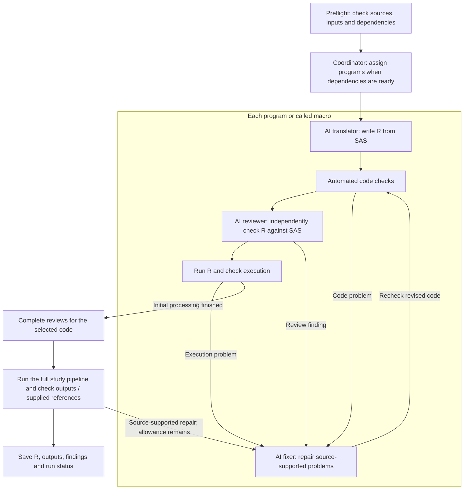

# sas2r: SAS to R for clinical programming

**sas2r** helps statistical programmers and biostatisticians translate SAS
programs for SDTM, ADaM, tables, listings and figures into R. It combines
rule-based translation with separate AI translation, review and repair roles,
then runs the R programs and reports the checks that passed or need attention.

The package **does not require SAS** to translate or run generated R. Comparing
results with SAS requires matching reference outputs. AI review does not replace
independent programming or your organization's statistical QC procedures.

[Quickstart](#quickstart) · [AI models](#choosing-an-ai-model) ·
[Parallel translation](#parallel-translation-opt-in) ·
[FAQ](#frequently-asked-questions) · [Guides](#guides)

## What it helps with

- Migrate connected SAS programs and called macros into R, including data
  preparation, analysis derivations and reporting workflows. AI agents translate,
  review and repair code, building on rule-based translation where available.
- Compare generated datasets with supplied SAS references, including row
  alignment, missing values, metadata and configurable numeric tolerances.
- Export editable R programs and supporting files that run without sas2r or an
  AI connection. Input libraries and generated outputs have separate locations.

## How a migration runs



The **translator**, **reviewer** and **fixer** are separate AI roles. The
**coordinator** is package logic that assigns work and controls program order,
repair limits and spending. Repairs return through the checks; unresolved
problems are reported rather than treated as successful translations. A
reference difference prompts investigation against the SAS source before repair.

Dependencies come from the SAS sources. For example, a summary program waits
for the program that creates its analysis dataset. Independent translation and
review can overlap; execution tests, repairs and the full study run happen one
at a time. See the [workflow guide](docs/running-migrations.md#workflow-and-review-order)
for review timing and how earlier passing results are protected.

## Quickstart

### 1. Install

AI translation requires **ellmer 0.4.2 or newer**. We recommend **ellmer 0.5.0**
for new installations; both versions pass our offline compatibility tests.
Deterministic workflows can run without ellmer.

<!-- sas2r-example: network install -->
```r
# install.packages("remotes")
install.packages("ellmer")
remotes::install_github("songyue-chen/sas2r")
```

### 2. Describe your study in `_sas2r.yml`

Create one small file, `_sas2r.yml`, in your project directory. It says where your data lives, which outputs matter, and which AI model to use:

```yaml
project: my_clinical_study

libraries:            # your SAS librefs and where their data files live
  sdtm:
    path: data/sdtm
    engine: xpt       # how to read members: xpt, sas7bdat, or rds
  adam:
    path: data/adam
    engine: xpt
    write: rds        # how translated programs save results: rds or xpt

outputs:              # what the migration must produce
  datasets:
    - adam.adsl
    - adam.adae
  references:         # optional: gold-standard SAS outputs to compare against
    adam.adsl: data/reference/adsl.xpt
    adam.adae: data/reference/adae.xpt

llm:                  # a recommended Flash starting profile
  provider: deepseek
  auth_mode: api_key
  model: deepseek-flash
  max_output_tokens: 393216
  capabilities:
    structured_output: fallback
    tool_calling: native
    reasoning_effort: unsupported # connector cannot set effort; server thinking stays on
  timeout_seconds: 1800
  max_tries: 1
```

Make `DEEPSEEK_API_KEY` available to your R session before translation. For Gemini
Flash or another provider, replace the `llm:` block with its complete
[provider profile](docs/llm-providers.md#2-configuration-examples-_sas2ryml).

### 3. Check the setup offline

<!-- sas2r-example: offline readme-preflight -->
```r
library(sas2r)
check <- sas_preflight(
  "programs/", config = "_sas2r.yml", out_dir = "migration_output",
  usage_limits = list(max_calls = 20)
)
print(check)
check$inputs       # availability and producer-order status
check$budget       # effective limits; no model calls are made
```

Preflight checks the source setup without model calls or reading dataset contents.
Review the findings: missing resources usually allow translation with warnings. See the [preflight guide](docs/clinical-qc-preflight.md)
for library paths, output requirements and QC profiles.

### 4. Run it

<!-- sas2r-example: network migration -->
```r
library(sas2r)

result <- sas_translate(
  path = check$project,            # reuse the unchanged source scan
  out_dir = "migration_output",
  usage_limits = list(max_calls = 20),
  execute = TRUE,                  # actually run the translated programs
  max_program_repair_rounds = 1,   # immediate repair attempts per program
  max_bundle_repairs_per_component = 2, # bundle repairs per component
  max_bundle_repair_rounds = NULL, # optional overall cap on bundle fixer calls
  agent_evidence = "code_only"     # what repair evidence the AI may see
)

# What you get back
result$status        # one of the four statuses below
result$bundle_dir    # all available selected programs and macros, including failed code
result$outputs_dir   # saved deliverables: datasets/<library>/ and tlf/ (NULL if none)
result$report_path   # a readable report of everything that happened

# Read a translated program
cat(sas_code(result, 1))

# Export the selected code, generated outputs, reports, and run guide
sas_write(result, "r_production/")
```

## Reading the results

Open `migration_output/<run_id>/START_HERE.html` first. It links the code,
outputs, diagnostics and comparison reports, and states what ran, what was
skipped, and why a run was blocked or failed. Saved code can be incomplete or
unvalidated; file existence alone does not establish success.

### The four statuses

| Status | Meaning |
| --- | --- |
| `blocked` | A required part failed: for example, execution, an output check or a dependency needed to continue. |
| `needs_review` | Required review or other evidence is incomplete. Some programs may have run successfully. |
| `migration_ready` | Required checks passed, but no required output has a passing SAS reference comparison. |
| `validated` | Required checks passed and at least one required output matched its reference within the configured tolerances. Other outputs may have no reference. |

**This is not proof of SAS equivalence.** Check which outputs were compared and
which remain unverified. Matching a reference does not establish that the
original SAS or the analysis specification is correct.

For a blocked run, inspect the named problem before changing code. A reference
mismatch alone does not justify a repair: first confirm that both results use the
same source programs, inputs and analysis definitions.

Use `resume = TRUE` to reuse compatible saved work; repair counts and recorded
spending are retained. `options(sas2r.progress = FALSE)` hides routine console
updates, while the final outcome and saved reports remain available. See
[logs, repairs and resume](docs/running-migrations.md#reading-the-progress-log).

## Parallel translation (opt-in)

The default is one program or called macro at a time. To allow up to two:

```yaml
migration:
  max_parallel_translations: 2
```

A *worker* is an R process handling an assigned translation or review task.
The limit covers whole workflows, including their review and repair steps;
it does not create that many of each AI role. All work shares the same run
budgets and quality checks. The count is not a CPU count: remote AI requests
spend time waiting, but memory and provider quotas still limit useful concurrency.

Parallel mode requires **ellmer 0.5.0 or newer** and `llm.max_tries: 1`.
If both `max_parallel_translations` and `max_tries` exceed 1, the run stops with
instructions to change one. Older ellmer uses one workflow and reports why.
Missing inputs or source dependencies produce warnings while available code keeps
translating. A failed component does not stop other programs. Reports distinguish
saved code from execution that could not run. Use `execute = FALSE` for code only;
omitting SAS references still permits execution. Unusable configuration and
pipeline omissions remain errors.

Start with one, then compare two on representative programs. Equal live-model
quality and a particular speedup are not established by the offline tests.
The [speed FAQ](#will-two-workers-halve-the-run-time-or-four-workers-quarter-it)
explains why more workers do not give proportional time savings.
See [parallel details](docs/running-migrations.md#parallel-translation-opt-in)
and [provider settings](docs/llm-providers.md#recommended-starting-settings).

## Choosing an AI model

**Start with Gemini Flash or DeepSeek Flash.** They offer a practical balance
of speed, cost and coding capability, making them our recommended first choice
for translation trials. Confirm accuracy on representative study programs with
the same code review, execution and output checks you would use with a frontier
model. Use a frontier model when the first choice leaves unresolved translation
problems. See the current [Gemini model documentation](https://ai.google.dev/gemini-api/docs/latest-model)
and [DeepSeek model and pricing information](https://api-docs.deepseek.com/quick_start/pricing/).

For OpenAI, start with **GPT-5.6 Luna**, which is designed for cost-sensitive,
high-volume work. Apply the same study-level accuracy checks.
See the [official Luna model documentation](https://developers.openai.com/api/docs/models/gpt-5.6-luna).

### Recommended starting settings

These are suggested profiles, not automatic package defaults. Model availability
and settings were checked on **September 18, 2026**. Use the documented maximum
output allowance when your endpoint accepts it and the request fits the context
window, to give reasoning and complete R code room to finish.

| Starting choice | Model | Reasoning | Output token ceiling | Request timeout |
| --- | --- | --- | ---: | ---: |
| Gemini Flash | `gemini-3.8-flash` | `high` | 65536 | 900 seconds |
| DeepSeek Flash | `deepseek-flash` | Keep server thinking default | 393216 | 1800 seconds |
| OpenAI Luna | `gpt-5.6-luna` | `high` | 128000 | 900 seconds |
| Claude Sonnet 5 | `claude-sonnet-5` | `high` with adaptive thinking | 128000 (see below) | 900 seconds |

- Set `llm.max_output_tokens` and `llm.timeout_seconds` to the values above.
  **Unused output allowance is not billed.** A higher ceiling permits more
  generation; actual usage, including billable reasoning, determines token cost.
  Timeouts are starting values per request, not a promise that the full output
  ceiling can be generated in that time.
- Use `max_tries: 1` and `capabilities.tool_calling: native`. Set
  `capabilities.structured_output: fallback` for Gemini, DeepSeek and Anthropic,
  or `native` for OpenAI. Leave `temperature` and `top_p` unset.
- With the documented DeepSeek connector, omit a top-level `reasoning_effort`
  and use `capabilities.reasoning_effort: unsupported`, as in the quickstart.
  This retains server-default thinking; it does not switch reasoning off.
- Start with `migration.max_parallel_translations: 1`, then try `2` with the
  same programs and checks. Increase further only when provider quotas and
  available memory permit.
- If you set `budget.max_output_tokens`, keep it at least as large as
  `llm.max_output_tokens`. Strict dollar budgets reserve worst-case costs before
  requests; larger ceilings may need more budget, especially with parallel work.

**Claude qualification:** Sonnet 5 replaces the older Sonnet 4.6 recommendation.
Its 128,000-token maximum is conditional guidance for this package: sas2r currently
uses non-streaming requests, and very long responses need transport validation.
Anthropic recommends streaming or batch processing for long requests; increasing
the token ceiling or timeout does not enable either. See the
[Claude profile](docs/llm-providers.md#anthropic) before using its full allowance.

Use the [provider guide](docs/llm-providers.md) for complete connection profiles,
model availability checks, output allowances, timeouts and tuning guidance.
The [full configuration template](inst/examples/_sas2r.example.yml) lists the
available study and model settings. Called macro folders are configured through
`macros.search_path`; see [macro setup and limitations](docs/running-migrations.md#called-macros-in-separate-folders).

## Privacy: What Your Model Provider Can Receive

Dataset processing and comparisons run on your infrastructure. AI requests can
contain SAS/R code, comments, paths and execution errors, which may themselves
contain patient information. The default `agent_evidence = "code_only"` excludes
explicit dataset previews; it does not de-identify source code or diagnostics.

`agent_evidence = "bounded"` permits capped candidate-output previews, including
row numbers, subject identifiers, key values and cell values. Reference comparison answers
remain outside the AI authoring/review tools. Use an organization-approved
endpoint and confirm its data residency and retention terms.
Read the [full privacy guidance](docs/model-privacy.md) before using confidential
study material; generated R is not a filesystem sandbox.

## Frequently asked questions

### What should I prepare before translating a study?

Provide the SAS programs, called macros and include files, the input data
locations, and the list of required outputs. Add matching SAS reference outputs
if available. Use `_sas2r.yml` to describe the study, then run `sas_preflight()`
to find setup problems before AI calls. See the [quickstart](#quickstart).

### Do I need SAS installed? Can I start without SAS reference outputs?

SAS is not required to translate code or run the generated R. Without reference
outputs, the package can still review code, test execution and apply configured
output checks, but it cannot compare results with SAS. A `migration_ready`
result is different from `validated`; see [the four statuses](#the-four-statuses).
For comparisons, use SAS outputs produced from the same programs, inputs,
macros and parameters.

### Does the AI reviewer replace independent programming or statistical QC?

No. It reviews translated R against the SAS source; it does not independently
implement the analysis from the protocol, SAP or programming specifications.
Your team's independent review and QC procedures still apply. The saved code,
findings and comparison reports help reviewers inspect the work.

### Does `validated` mean every dataset and analysis is correct?

No. It means the configured reference comparisons passed within the declared
tolerances, alongside the package's required checks. An output without a
reference has not received that comparison. Read the report's coverage and
unresolved findings; the status does not establish that the original SAS,
the analysis specification or every statistical result is correct.

### Will sas2r correct my ADaM derivations or make them CDISC compliant?

The translation follows the supplied SAS. It does not independently decide
whether a population definition, baseline rule, imputation or analysis method is
appropriate for the study. Review those decisions against the SAP and dataset
specifications, and perform your usual CDISC checks separately. A problem in
the original SAS can remain a problem in a faithful translation.

### Are tables, listings and figures checked as fully as datasets?

Dataset comparisons check the configured reference data and tolerances. A
readable table or figure file alone does not establish that its content is
correct. Review the analysis populations, denominators, statistics, rounding,
labels and presentation, as applicable. See the
[output-evidence guide](docs/output-evidence.md) for comparison coverage.

### Can dependent programs translate at the same time?

A program waits for its required upstream programs to finish initial translation
and checks. For example, a summary program waits for the derivation it reads.
Unrelated programs or macros can use the other available workers. The full
study run still follows dependency order. Parallel mode retains the existing
checks, but unchanged live-model quality and speedup have not yet been
established by a paired study run. See [parallel translation](#parallel-translation-opt-in).

### Will two workers halve the run time, or four workers quarter it?

No. **Two workers do not guarantee 50% of the one-worker time, and four do not
guarantee 25%.** The setting allows up to that many workflows at once; it does
not divide every step of a study evenly among them:

- **Dependencies:** a table program may need to wait for an analysis dataset
  program. Extra workers help only when independent work is ready.
- **Steps that run one at a time:** execution checks, repairs and the full study
  run remain serial, with the same quality checks.
- **Uneven work:** a large program or complex macro can take much longer than
  others, leaving workers idle near the end.
- **Shared limits:** provider request/token quotas, response times, local CPU
  and memory, and worker startup/coordination overhead can reduce the benefit.

For illustration, suppose a one-worker run takes 60 minutes: 20 minutes must
run one at a time and 40 minutes can be shared perfectly. Even with no extra
overhead, two workers would take **40 minutes**, and four **30 minutes**.
This is an example, not a measured sas2r benchmark. Compare elapsed time and
output checks on the same representative study before increasing the setting.

### What should I do when a run is blocked or a comparison fails?

Start with the console message and the saved `START_HERE.html` report, when
available. They identify the reason, what ran and what still needs attention.
Check input paths, missing programs or macros, and the reported code error.
For comparison failures, first confirm that the SAS reference uses the same
inputs and specifications. Do not change R code merely to match a reference
that represents a different analysis. See
[reference differences](docs/running-migrations.md#reference-differences-translation-error-or-different-specification).

### Must I restart everything after an interruption or a fix?

Use `resume = TRUE` to reuse compatible saved work. Changed source code, inputs
or other relevant settings can require fresh translation or checks. Repair
allowances and recorded spending are retained; resume does not reset them.
See [resume and limit provider calls](docs/running-migrations.md#resume-and-limit-provider-calls).

### Can patient data reach the AI provider?

Data processing runs locally, and the default `agent_evidence = "code_only"`
omits explicit dataset previews. However, SAS source, comments and error messages
can contain patient information and can be sent to the configured provider.
`code_only` does not de-identify them. Use your organization's approved endpoint
and review the [privacy details](docs/model-privacy.md)
before using confidential study material.

### Can our programmers edit and run the R code without sas2r or AI?

Yes. Export with `sas_write()` and keep the complete exported set of scripts and
supporting files. Its guide lists required R packages and input paths; `run.R`
launches the programs in order without sas2r or an AI key. Human edits and manual
reruns need new QC and do not automatically update the saved migration report.

## Guides

| I want to… | Read |
| --- | --- |
| Set up libraries, required outputs and QC checks | [Preflight and QC](docs/clinical-qc-preflight.md) |
| Understand logs, repairs, resume, macros or exported files | [Running migrations](docs/running-migrations.md) |
| Choose a provider and configure model settings | [AI providers](docs/llm-providers.md) |
| Compare saved datasets and investigate differences | [Output comparisons](docs/output-evidence.md) |
| Understand acceptance rules and recorded evidence | [Migration evidence](docs/migration-evidence.md) |
| Understand what can be sent to an AI provider | [Privacy](docs/model-privacy.md) |

For regulated work, review migrated code and outputs under your organization's
SOPs. Automated translation does not replace required independent review or QC.

For quick browser-based code translation, see the separate [sas2r.ai](https://sas2r.ai)
companion site. Its workflow differs from this R package.

## License

Apache License 2.0. See [LICENSE.md](LICENSE.md).
