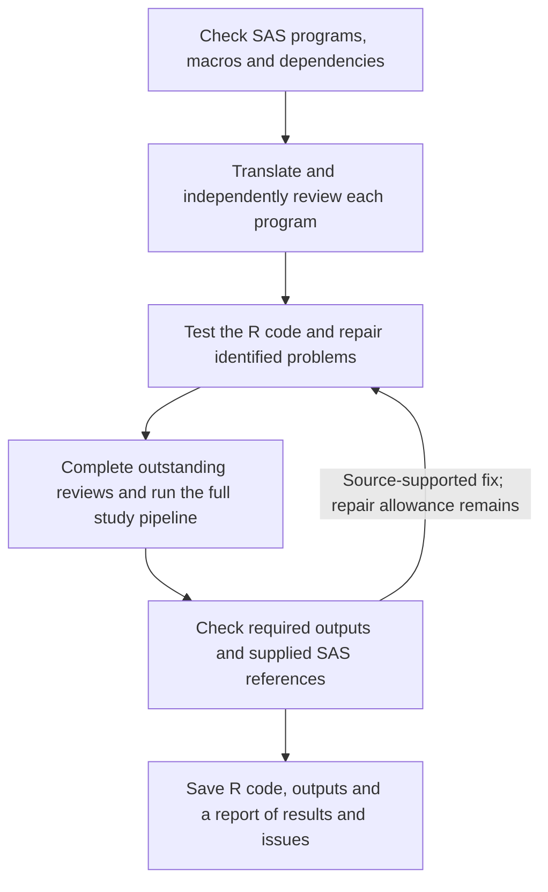

# sas2r: SAS to R for clinical programming

**sas2r** helps statistical programmers and biostatisticians translate SAS
programs for SDTM, ADaM, tables, listings and figures into R. It combines
rule-based translation with separate AI translation, review and repair roles,
then runs the R programs and reports the checks that passed or need attention.

The package **does not require SAS** to translate or run generated R. Comparing
results with SAS requires matching reference outputs. AI review does not replace
independent programming or your organization's statistical QC procedures.

[Quickstart](#quickstart) · [Parallel translation](#parallel-translation-opt-in) ·
[FAQ](#frequently-asked-questions) · [Guides](#guides)

## What it helps with

- Translate common DATA steps and procedures; use AI for more complex code and
  called macros, with unsupported cases and unresolved findings reported.
- Compare generated datasets with supplied SAS references, including row
  alignment, missing values, metadata and configurable numeric tolerances.
- Export editable R programs and supporting files that run without sas2r or an
  AI connection. Input libraries and generated outputs have separate locations.

## How a migration runs



The **translator** writes R, the **reviewer** checks it against SAS, and the
**fixer** addresses identified problems. The package controls program order,
repair limits and spending. This scheduling logic is called the *coordinator*.

Dependencies come from the SAS sources. For example, a summary program waits
for the program that creates its analysis dataset. Independent translation and
review can overlap; execution tests, repairs and the full study run happen one
at a time. See the [workflow guide](docs/running-migrations.md#workflow-and-review-order)
for review timing and how earlier passing results are protected.

## Quickstart

### 1. Install

AI translation requires **ellmer 0.4.2 or newer**. We recommend **ellmer 0.5.0**
for new installations; both versions pass our offline compatibility tests.
Deterministic workflows can run without ellmer.

<!-- sas2r-example: network install -->
```r
# install.packages("remotes")
install.packages("ellmer")
remotes::install_github("songyue-chen/sas2r")
```

### 2. Describe your study in `_sas2r.yml`

Create one small file, `_sas2r.yml`, in your project directory. It says where your data lives, which outputs matter, and which AI model to use:

```yaml
project: my_clinical_study

libraries:            # your SAS librefs and where their data files live
  sdtm:
    path: data/sdtm
    engine: xpt       # how to read members: xpt, sas7bdat, or rds
  adam:
    path: data/adam
    engine: xpt
    write: rds        # how translated programs save results: rds or xpt

outputs:              # what the migration must produce
  datasets:
    - adam.adsl
    - adam.adae
  references:         # optional: gold-standard SAS outputs to compare against
    adam.adsl: data/reference/adsl.xpt
    adam.adae: data/reference/adae.xpt

llm:                  # the AI model (see the provider guide below)
  provider: anthropic
  model: claude-sonnet-4-6
  reasoning_effort: high
  max_output_tokens: 32768
  capabilities:
    structured_output: fallback
    tool_calling: native
  timeout_seconds: 900
  max_tries: 1
```

### 3. Check the setup offline

<!-- sas2r-example: offline readme-preflight -->
```r
library(sas2r)
check <- sas_preflight(
  "programs/", config = "_sas2r.yml", out_dir = "migration_output",
  usage_limits = list(max_calls = 20)
)
print(check)
check$inputs       # availability and producer-order status
check$budget       # effective limits; no model calls are made
```

Preflight checks the source setup without model calls or reading dataset contents.
Resolve reported problems before translating. See the [preflight guide](docs/clinical-qc-preflight.md)
for library paths, output requirements and QC profiles.

### 4. Run it

<!-- sas2r-example: network migration -->
```r
library(sas2r)

result <- sas_translate(
  path = check$project,            # reuse the unchanged source scan
  out_dir = "migration_output",
  usage_limits = list(max_calls = 20),
  execute = TRUE,                  # actually run the translated programs
  max_program_repair_rounds = 1,   # immediate repair attempts per program
  max_bundle_repairs_per_component = 2, # bundle repairs per component
  max_bundle_repair_rounds = NULL, # optional overall cap on bundle fixer calls
  agent_evidence = "code_only"     # what repair evidence the AI may see
)

# What you get back
result$status        # one of the four statuses below
result$bundle_dir    # all available selected programs and macros, including failed code
result$outputs_dir   # saved deliverables: datasets/<library>/ and tlf/ (NULL if none)
result$report_path   # a readable report of everything that happened

# Read a translated program
cat(sas_code(result, 1))

# Export the selected code, generated outputs, reports, and run guide
sas_write(result, "r_production/")
```

## Reading the results

Open `migration_output/<run_id>/START_HERE.html` first. It links the code,
outputs, diagnostics and comparison reports, and states what ran, what was
skipped, and why a run was blocked or failed. Saved code can be incomplete or
unvalidated; file existence alone does not establish success.

### The four statuses

| Status | Meaning |
| --- | --- |
| `blocked` | A required part failed: for example, execution, an output check or a dependency needed to continue. |
| `needs_review` | Required review or other evidence is incomplete. Some programs may have run successfully. |
| `migration_ready` | Required checks passed, but no required output has a passing SAS reference comparison. |
| `validated` | Required checks passed and at least one required output matched its reference within the configured tolerances. Other outputs may have no reference. |

**This is not proof of SAS equivalence.** Check which outputs were compared and
which remain unverified. Matching a reference does not establish that the
original SAS or the analysis specification is correct.

For a blocked run, inspect the named problem before changing code. A reference
mismatch alone does not justify a repair: first confirm that both results use the
same source programs, inputs and analysis definitions.

Use `resume = TRUE` to reuse compatible saved work; repair counts and recorded
spending are retained. `options(sas2r.progress = FALSE)` hides routine console
updates, while the final outcome and saved reports remain available. See
[logs, repairs and resume](docs/running-migrations.md#reading-the-progress-log).

## Parallel translation (opt-in)

The default is one program or called macro at a time. To allow up to two:

```yaml
migration:
  max_parallel_translations: 2
```

A *worker* is an R process handling an assigned translation or review task.
The limit covers whole workflows, including their review and repair steps;
it does not create that many of each AI role. All work shares the same run
budgets and quality checks. The count is not a CPU count: remote AI requests
spend time waiting, but memory and provider quotas still limit useful concurrency.

Parallel mode requires **ellmer 0.5.0 or newer** and `llm.max_tries: 1`.
If both `max_parallel_translations` and `max_tries` exceed 1, the run stops with
instructions to change one. Older ellmer uses one workflow and reports why.
Known invalid pipelines stop in preflight; new dependency findings during
translation put affected work on hold and block the full study run.

Start with one, then compare two on representative programs. Equal live-model
quality and a particular speedup are not established by the offline tests.
See [parallel details](docs/running-migrations.md#parallel-translation-opt-in)
and [provider settings](docs/llm-providers.md#recommended-starting-settings).

## Choosing an AI model

Evaluate Gemini Flash or DeepSeek Flash on representative programs first;
frontier models are available when the first model leaves unresolved errors.
Keep the same review and output checks with every model. A fast answer or a
successful connection does not establish correct translation.

Use the [provider guide](docs/llm-providers.md) for complete connection profiles,
model availability checks, output allowances, timeouts and tuning guidance.
The [full configuration template](inst/examples/_sas2r.example.yml) lists the
available study and model settings. Called macro folders are configured through
`macros.search_path`; see [macro setup and limitations](docs/running-migrations.md#called-macros-in-separate-folders).

## Privacy: What Your Model Provider Can Receive

Dataset processing and comparisons run on your infrastructure. AI requests can
contain SAS/R code, comments, paths and execution errors, which may themselves
contain patient information. The default `agent_evidence = "code_only"` excludes
explicit dataset previews; it does not de-identify source code or diagnostics.

`agent_evidence = "bounded"` permits capped candidate-output previews, including
row numbers, subject identifiers, key values and cell values. Reference comparison answers
remain outside the AI authoring/review tools. Use an organization-approved
endpoint and confirm its data residency and retention terms.
Read the [full privacy guidance](docs/model-privacy.md) before using confidential
study material; generated R is not a filesystem sandbox.

## Frequently asked questions

**Do I need SAS reference outputs to start?** No, but without them the package
cannot compare R results with SAS. Execution and review provide different evidence.

**Will it correct my analysis definitions or make ADaM CDISC compliant?** It
follows the supplied SAS. Check study definitions against the SAP/specifications
and perform your usual CDISC and independent statistical QC separately.

**Are tables and figures fully checked?** Producing a readable file is
insufficient. Review populations, denominators, statistics, labels and presentation.

**Can dependent programs translate together?** A program waits for its required
upstream programs. Independent programs and macros can use the other workers.

**Can our team edit and run the exported R?** Yes. Keep the complete export,
install its listed R packages and configure input paths. Manual changes need new
QC and do not automatically update the saved migration report.

More questions about setup, validation, interrupted runs and privacy are answered
in the [study-team FAQ](docs/running-migrations.md#frequently-asked-questions).

## Guides

| I want to… | Read |
| --- | --- |
| Set up libraries, required outputs and QC checks | [Preflight and QC](docs/clinical-qc-preflight.md) |
| Understand logs, repairs, resume, macros or exported files | [Running migrations](docs/running-migrations.md) |
| Choose a provider and configure model settings | [AI providers](docs/llm-providers.md) |
| Compare saved datasets and investigate differences | [Output comparisons](docs/output-evidence.md) |
| Understand acceptance rules and recorded evidence | [Migration evidence](docs/migration-evidence.md) |
| Understand what can be sent to an AI provider | [Privacy](docs/model-privacy.md) |

For regulated work, review migrated code and outputs under your organization's
SOPs. Automated translation does not replace required independent review or QC.

For quick browser-based code translation, see the separate [sas2r.ai](https://sas2r.ai)
companion site. Its workflow differs from this R package.

## License

Apache License 2.0. See [LICENSE.md](LICENSE.md).
