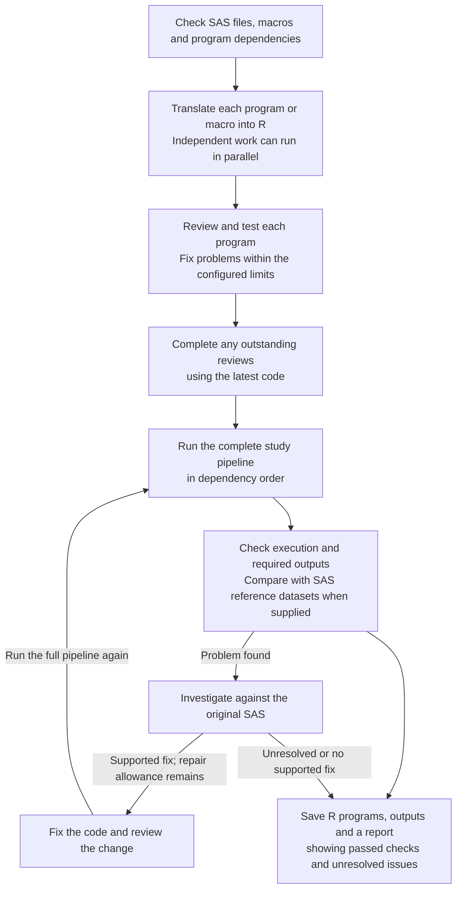

# sas2r: SAS to R Translation & Migration Evidence for Clinical Programming

> **Use R to get R.**

<!-- badges: start -->
<!-- badges: end -->

**sas2r** is an open-source R package for **clinical statistical programmers and biostatisticians** in pharmaceutical, biotech, and CRO organizations. It helps translate SAS programs for SDTM, ADaM, tables, listings and figures into R. Separate AI roles translate the code, review it against the original SAS, and fix identified problems. The package runs the translated programs, checks their outputs, and reports what passed and what still needs attention.

`sas2r` does not require SAS to translate or execute the generated R. Dataset processing and comparison run on your own infrastructure; a configured AI provider receives the [code, context and diagnostics described below](#privacy-what-your-model-provider-can-receive). Reference-based validation requires outputs from the corresponding SAS programs, using the same inputs and parameters.

Start with [how a migration runs](#how-a-migration-runs), the [quickstart](#quickstart),
or the [FAQ for study teams](#frequently-asked-questions).

> **Also check out [sas2r.ai](https://sas2r.ai)** — a web-based companion tool for quick, browser-based SAS to R code translation. While sas2r.ai currently uses direct model translation for rapid code conversions, we plan to bring this R package's multi-agent workflow and dataset QC capabilities to the cloud platform in the future!

---

## Why Statistical Programmers Use sas2r

- **Built for clinical data work.** The rule-based translator handles the bread-and-butter patterns on its own — DATA step derivations and filters, `MERGE (in=a in=b)`, `PROC SORT`, `MEANS`, `FREQ`, `FORMAT`, and simple `PROC SQL`. It also knows SAS habits R does not share: how missing values sort and compare, trailing blanks in character values, and case-insensitive variable names all behave the SAS way in the translated code.
- **Honest about what it can't do.** SAS patterns the rules cannot prove — `RETAIN`, `FIRST.` / `LAST.` logic, `OUTPUT` statements, `PROC TRANSPOSE`, macros — are never silently guessed. Each one is clearly marked and handed to an AI translator, and a second, independent AI reviewer reads the result against your original SAS before it is accepted.
- **Automated dataset QC.** If you provide reference SAS datasets (`.sas7bdat`, `.xpt`, or `.rds`), `sas2r` compares each generated R dataset against them: it lines up rows even when their order differs, understands duplicate key values, applies SAS missing-value and blank-padding rules, and checks numbers to configurable tolerances.
- **Your source data is never touched.** Input libraries are opened read-only, and every run writes into its own separate working copy (copy-on-write), so a failed attempt can never contaminate your data or a previous good result.
- **Standalone R programs you can take anywhere.** Export plain R scripts, `autoexec.R`, runtime files, and a dependency-ordered launcher with `sas_write()`. The exported guide lists required R packages and external input libraries; `sas2r` itself is not required to run the bundle. The runtime is documented and versioned: see `?sas2r_runtime` and `vignette("runtime-helpers")`.
- **Repairs grounded in the source.** Execution errors and findings supported by the SAS can trigger an AI repair. A reference mismatch alone triggers a bounded source review. Each accepted repair is tested in a fresh bundle run, with earlier evidence protected from regressions.

---

## How a migration runs

The work has two parts: **translate and check individual programs**, then
**run the complete study pipeline and check its outputs**. Called macros are
translated too, so programs can use their R equivalents.

Three AI roles help with the work:

| Role | What it does |
| --- | --- |
| Translator | Writes R code based on the original SAS, its macros and the programs it depends on. |
| Reviewer | Separately checks the R code against the SAS and reports possible translation errors. |
| Fixer | Corrects identified problems supported by the SAS source. The changed code is reviewed and tested again. |

The package controls the order of work, the number of repair attempts and the
spending limits using fixed rules. This scheduling logic is called the
**coordinator** in the logs; it is not another AI model. AI review helps find
problems but does not replace independent statistical QC.



**Program dependencies determine the order.** For example, if ADVS reads ADSL
and a table reads ADVS, the order is ADSL → ADVS → table. `sas2r` determines this
from the SAS sources; these program names are not built into the package.
With [parallel translation](#parallel-translation-opt-in), independent programs
or macros can be translated and reviewed at the same time. A program waits for
the programs it uses to finish their initial translation and checks.

Program execution tests and repairs run one at a time. If a repair changes a
shared R function, programs that use it are checked again. Before running the
full pipeline, the package completes outstanding reviews of the code versions
that will be used. That review step reports findings without changing the code.
The full pipeline also runs one program at a time in dependency order.

**Known pipeline problems, such as missing schedule entries or dependency cycles,
stop the run before AI calls.** A new dependency problem found during translation
puts the affected programs on hold while unrelated
work can continue. The full pipeline remains blocked until the dependency issue
is resolved. The exported set of R programs and supporting files is called the
**bundle**; having those files does not mean all checks passed.

A repair cannot replace the chosen result if it loses checks that had already
passed. If a new run initially performs worse than a saved result, that earlier
result is retained while the new run uses its remaining repair allowance. If a
later repair makes the chosen result from the current run worse, further repair
stops and that chosen result is kept. The report distinguishes retained results
from the outcome of the current run.

---

## Quickstart

### 1. Install

AI translation requires **ellmer 0.4.2 or newer**. We recommend **ellmer 0.5.0**
for new installations; both versions pass our offline compatibility tests.
Deterministic workflows can run without ellmer.

<!-- sas2r-example: network install -->
```r
# install.packages("remotes")
install.packages("ellmer")
remotes::install_github("songyue-chen/sas2r")
```

### 2. Describe your study in `_sas2r.yml`

Create one small file, `_sas2r.yml`, in your project directory. It says where your data lives, which outputs matter, and which AI model to use:

```yaml
project: my_clinical_study

libraries:            # your SAS librefs and where their data files live
  sdtm:
    path: data/sdtm
    engine: xpt       # how to read members: xpt, sas7bdat, or rds
  adam:
    path: data/adam
    engine: xpt
    write: rds        # how translated programs save results: rds or xpt

outputs:              # what the migration must produce
  datasets:
    - adam.adsl
    - adam.adae
  references:         # optional: gold-standard SAS outputs to compare against
    adam.adsl: data/reference/adsl.xpt
    adam.adae: data/reference/adae.xpt

llm:                  # the AI model (see the provider guide below)
  provider: anthropic
  model: claude-sonnet-4-6
```

### 3. Check the setup offline

<!-- sas2r-example: offline readme-preflight -->
```r
library(sas2r)
check <- sas_preflight(
  "programs/", config = "_sas2r.yml", out_dir = "migration_output",
  usage_limits = list(max_calls = 20)
)
print(check)
check$inputs       # availability and producer-order status
check$budget       # effective limits; no model calls are made
```

Preflight reports setup findings before translation. It does not read dataset
contents or test model credentials. `check$project` preserves its configuration
and output requirements for translation. A plain `config` list supplied with
`check$project` updates only the named top-level settings; explicit `NULL` clears
a setting. The saved project uses absolute source paths and can be reused from
another working directory. Rescan the source path when sources or library
bindings change. [The preflight and QC guide](docs/clinical-qc-preflight.md)
has a self-contained example and reusable profiles for labels, formats, types,
column order, keys, uniqueness, row counts, and per-variable tolerances.

### 4. Run it

<!-- sas2r-example: network migration -->
```r
library(sas2r)

result <- sas_translate(
  path = check$project,            # reuse the unchanged source scan
  out_dir = "migration_output",
  usage_limits = list(max_calls = 20),
  execute = TRUE,                  # actually run the translated programs
  max_program_repair_rounds = 1,   # immediate repair attempts per program
  max_bundle_repairs_per_component = 2, # bundle repairs per component
  max_bundle_repair_rounds = NULL, # optional overall cap on bundle fixer calls
  agent_evidence = "code_only"     # what repair evidence the AI may see
)

# What you get back
result$status        # one of the four statuses below
result$bundle_dir    # all available selected programs and macros, including failed code
result$outputs_dir   # saved deliverables: datasets/<library>/ and tlf/ (NULL if none)
result$report_path   # a readable report of everything that happened

# Read a translated program
cat(sas_code(result, 1))

# Export the selected code, generated outputs, reports, and run guide
sas_write(result, "r_production/")
```

Open `migration_output/<run_id>/START_HERE.html` first. It links the selected
scripts, errors, output comparisons, and instructions for running or editing code.
Its top banner summarizes the current run, the reason for any block or failure,
affected components, and whether component fixes, bundle execution and bundle
fixes ran. The same summary is printed to the console and saved in
`<run_id>/diagnostics/logs/run-outcome.log`. An existing bundle or saved partial
code does not mean the current run completed successfully.

Before provider setup, the shared preflight checks that every scanned source file
is accounted for in the pipeline. Inspect `sas_preflight(...)$pipeline$sources`
for each file's components, translation positions and execution roles: main
program, startup, called macro, included by its caller, or an explicit
exclusion when no active source units remain. `$pipeline$execution_order` uses
the same bundle planner as execution. Unexplained omissions, duplicate scheduled
components, conflicting component names and known dependency cycles stop
translation before model calls. For example, a regular `setup.sas` file cannot
share the reserved startup component with `autoexec.sas`; preflight names both
files and asks you to rename the conflicting source and rescan.
Complete coverage is separate from input availability and translation quality;
preflight can still report `needs_attention` for other findings.
The main programs are listed in dependency order; this does not mean they are
independent. A consumer waits for its upstream components during parallel
translation, and the full bundle executes the main programs serially in that order.

```text
<run_id>/
  START_HERE.html
  manifest.json
  bundle/                 # all available selected code, including failed code
    README.md
    run.R
    autoexec.R
    programs/
    macros/
    runtime/
    output/               # manual reruns only; created when needed
  outputs/                # saved automated deliverables
    datasets/<library>/
    tlf/
  report/                 # translation.md, report.json, comparison-details/
  diagnostics/            # attempts, revisions, smoke tests, logs, scratch data
```

A component that produced no code is labelled **not generated**. A completed
execution is separate from reference equivalence; saved outputs can be partial
or unvalidated. Requested WORK datasets are deliverables too. Unrequested scratch
files stay in diagnostics, and previous attempts retain their own evidence.

From `result$bundle_dir`, run `Rscript run.R` or `source("run.R")` in a fresh R
session. The launcher loads the runtime and macros, then runs programs in
order. Manual writes use `.sas2r_output_root` in `autoexec.R`, initially
`bundle/output/`; they do not overwrite saved automated outputs. Change that
root to keep separate manual iterations. Relative report files are written below
`output/tlf/`; review explicit paths or other relative file access in edited code.

`sas_write()` copies this editable bundle and its guide. Saved automated outputs
are exported separately under `saved-outputs/`, and reports under `report/`.
Copy the whole bundle when moving it, install the R packages listed in its guide,
and either copy inputs or configure accessible external data paths. No LLM key or
sas2r installation is needed to run the included runtime. Failed scripts remain
available for human repair; edits and reruns require new QC.

Relative paths inside translated LIBNAME calls resolve against
`.sas2r_execution_root` in `autoexec.R`, initially the source project directory.
Relative paths in the registry itself remain relative to the bundle folder.
Rebinding a known physical library retains its separate write folder, so later
programs can read earlier generated datasets. New library assignments receive
separate output folders; an explicit `write_path` still takes effect. Missing
input errors list the paths searched and execution root.

Input data is not copied: update `.sas2r_execution_root`, the registry in
`autoexec.R`, and any explicit source LIBNAME
paths if those inputs move. A manual rerun does not update the exported report.

Shared helper repairs replace only the complete functions the fixer changes.
Omitted functions remain available, including prior accepted helper edits.
Checks, static review, smoke tests and the exported bundle use the same assembled
helper runtime; rejected candidates leave the retained runtime intact.

When a required output is absent and a recorded intermediate is empty, sas2r
investigates the producer and consumer source/code before authorizing a repair
for that issue. Empty data alone does not prove which script is wrong. The
observation stays in local diagnostics; agents receive no rows, row counts or
reference comparison answers. Independent source-grounded defects remain
repairable. Execution blockers take priority within the existing limits.

Dependency context gives SAS and R bodies paired space and marks truncation.
A scheduled follow-up can recover an unavailable review by explicitly reviewing
the full component with extra focus. A clean focused-only review does not replace
a full review; the report shows both outcomes.

Component review checks whether the R preserves the SAS calculations, filters,
merges and side effects. Bundle repair adds an integration focus: how selected
callers and callees exchange values, which inputs are available, execution order,
and required output content. Changed code still receives a full semantic review.
Within the existing context limit, bundle requests include selected downstream
caller/consumer source and R code as well as upstream dependencies.
The reviewer remains static and read-only; runtime diagnostics come from the
executor. Completed reviews are reused only for the same source, code, helpers,
dependencies, policy, model settings, scope and supplied diagnostic context.
Changed installed-dependency facts can refresh that review without regenerating
the saved translation; changing only budgets or connection timeouts does not.

Harmless representation differences, such as unobserved trailing padding or
figure spacing, need not be reproduced. Source-visible truncation, special
missing-value behavior, statistics, meaningful labels and report sections still
matter. File existence alone does not prove a complete report. Simple, uniquely
bound source `KEEP`/`DROP` declarations can explain excluded columns; ambiguous
syntax remains unknown. These facts cannot authorize invented values or changed
source rules, and reference comparison settings stay outside authoring context.

The starting page, manifest and translation report distinguish all recorded
bundle attempts from execution of the current revision and selection. A prior
attempt is credited to the current code only when its recorded source, code,
helper and preceding-component context match. Older records lacking that
information remain visible without certifying the current scripts.

Bundle repair defaults to **two fixer calls per component**, in addition to the
immediate program-repair allowance. `max_bundle_repair_rounds = NULL` lets that
bounded allowance scale with the number of components; supply a number to cap
total bundle fixer calls, or `0` to disable them. `usage_limits` still bounds the
whole run. Failed and ineffective repair calls consume their component allowance.

The authoritative bundle run stops at the first execution error. sas2r then
checks unvisited independent branches in fresh smoke environments, queues known
mechanical and output failures by component, and repairs independent causes
before rerunning the full bundle. Downstream failures caused by an upstream
blocker wait for fresh evidence. An identical patch or failed fixer is deferred;
other independent components can continue. A shared-helper patch requires a
fresh run before further repairs. Diagnostic outputs never replace the complete
bundle acceptance check, and lost execution or output coverage rejects a repair.
Repair counts, deferred components, and diagnostic records appear in the report.

Each translator, reviewer, or fixer invocation has a **30-tool-call shared
allowance** by default. Individual tools inherit that allowance, so several
useful rule or macro lookups do not exhaust a separate small quota. A project
can adjust a role in `.sas2r/agents/translator.yml` (likewise `reviewer.yml` and
`fixer.yml`):

<!-- sas2r-example: agent translator -->
```yaml
tool_call_limit: 45
tools:
  search_skills: { max_calls: 6 } # optional narrower quota for this tool
```

The shared ceiling and any explicit tool quotas remain enforced; they reset on
the next agent invocation. The run-wide `usage_limits$max_tool_calls` is separate.
The model sees its remaining allowance. At exhaustion, native ellmer gathering
stops and the runner requests a final answer with tools closed and the evidence
already collected. Final-answer retries remain bounded; an incomplete answer
still cannot pass validation. Expected tool refusals and invalid arguments return
feedback, while unexpected tool errors remain visible. Completing an agent
request does not mean that every requested lookup succeeded.

Before generation, the console shows loaded R, sas2r and ellmer versions and the
effective agent and repair limits. The same information is saved in the run report
and usage ledger. Tool records include component, revision, request and invocation
identifiers; completion messages identify denied or failed lookups.

### The four statuses

Every run ends in exactly one status. It is decided from what actually executed and what the output checks found — never from what an AI model claims:

- **`blocked`** — something required went wrong: a program failed to run, or a required output is missing or doesn't match. The report names the program and shows the evidence.
- **`needs_review`** — execution was deferred, or required review/lineage evidence remains incomplete or blocked. Programs may still have run successfully; read the reported reason.
- **`migration_ready`** — bundle execution, required output checks, and lineage requirements passed, without passing reference evidence for a required target. This can mean only existence/readability checks were available.
- **`validated`** — those requirements passed and at least one required target supplied a passing reference comparison. Other outputs can remain unreferenced.

Check coverage alongside the status: `print(result)` and the reports distinguish
outputs produced, reference-compared, passed, and reference-passed. The JSON
report lists `validated_targets` and `unreferenced_targets` under `coverage`.
For example, one passing referenced output and two unreferenced outputs can
produce `validated`; it does not mean all three were compared.

**THIS IS NOT PARITY.** `validated` means your configured reference comparisons passed under the tolerances you declared. It is not proof of SAS equivalence, and it does not replace double programming or independent statistical QC.

### Reading the progress log

Live console updates are enabled by default in interactive R and `Rscript`.
Set `options(sas2r.progress = FALSE)` before a run to hide routine progress,
including the initial preflight summary; use `options(sas2r.progress = TRUE)`
to show it again. This is an R session option, not an `_sas2r.yml` setting.
It controls console output only: translation, parallelism and quality checks
run the same way. The final outcome and report locations remain visible, and
saved diagnostics and HTML reports are still written. The final outcome also
includes the pipeline summary. Tests disable routine progress by default.

| Log message | What it establishes |
| --- | --- |
| `reviewer ...: review completed: repair_required, 3 tool calls` | The request completed and the review found a material issue. The tool count describes tool use, not findings. Older logs use `ok` for request completion alone. |
| `coordinator ...: mechanical checks passed` | Generated code passed syntax and mechanical contract checks. |
| `coordinator ...: review completed -- reviewed_no_material_finding` | The review found no material issue. Execution and reference comparison remain separate checks. |
| `coordinator ...: review unavailable` | No usable review was obtained. The reason is recorded, and smoke execution may continue. |
| `smoke ...: passed` | The program executed and any applicable source population checks passed. Inspect unverified checks separately; this does not establish agreement with SAS reference data. |
| `smoke ...: failed -- blocked by upstream: ...` | Execution failed in the named dependency. The consumer is recorded as blocked and is not sent to the fixer for that upstream crash. |
| `bundle ... assessed -- migration_ready` | The selected bundle met the requirements described above. Read reference coverage separately. |
| `ERROR: coordinator ...: Dependency findings require source reconciliation: ...` | The named component and its consumers are deferred. Unaffected work may continue, but full-bundle execution is blocked. |
| `ERROR: Run incomplete - blocked` | A required part of the migration could not complete or pass. The summary names the reason, recorded activity and next action. |
| `ERROR: Run incomplete - failed` | An exception terminated the run. Available diagnostics are saved and the original exception is raised. |
| `WARNING: Run requires review` | The run returned `needs_review`; inspect the outstanding review or execution evidence before use. |

A controlled block still returns the `sas2r_translation` result and preserves
available work. The error severity makes the incomplete outcome visible without
aborting independent work immediately. The HTML uses a red banner for a blocked
or failed run and an amber banner when review is required. Attempted execution,
fixer invocation and passing validation are reported separately; invoking a fixer
does not mean its patch was accepted or its findings resolved.

Review findings can trigger a fixer even after mechanical checks and smoke tests
pass. A repaired revision is checked, reviewed, and executed before selection.
A repair that loses passing mechanical, execution, review, or source population
evidence is rejected; the previous revision and its unresolved findings remain.
Errors include the underlying R condition and saved execution logs. If a current
run is blocked while an older selected bundle remains on disk, the progress log
identifies that older selection explicitly.

`max_program_repair_rounds` is the total immediate-repair allowance per
component for the run, including revisits. A deferred component is retried when
its relevant dependencies change or a specifically awaited caller becomes
available. Completed reviews are reused within a run when the code, dependency
code, helper runtime and review configuration are unchanged.

Each fixer invocation can make one additional, budgeted request to correct a
parse or lint error in its proposed code. Persistent mechanical failures keep
the previous selected revision and save the rejected candidate's diagnostics.
An identical patch means no change was proposed; it does not clear the failure.
Bundle repair can still address a separately documented downstream code defect
after an upstream no-op. Downstream mismatches inherited from unresolved inputs
wait for those inputs to be resolved.

Unexpanded output expressions, such as `figure-&group..pdf`, appear separately
from concrete output targets in the report and starting page. Finding matching
files does not establish that the entire expected family was produced. An
unresolved required expression prevents readiness; its filenames and coverage
need source-grounded review.

For debugging a failed bundle, use `sas_translate(..., keep_raw_attempts = TRUE)`
to retain each component smoke execution's separate library folders and `run.R`
replay script. The component's `smoke_execution` in `report.json` lists the
output paths, hashes, configured-input hashes from run startup and replay path. These are partial
execution artifacts, not reference-validated final datasets. By default, raw
unselected outputs are pruned; smoke records and logs remain available under
`smoke_attempt_001/logs/` in the run folder.

Translator, reviewer, and fixer receive runtime signatures, argument rules,
return values, limitations, and examples directly from the package's helper
reference. Mechanical checks reject invented helper arguments before execution.
For equality, use `chr_cmp(a, b, op = "==")`; `op = "="` raises an error.
Omitting `op` returns an ordering result (`-1`, `0`, `1`), so an explicit operator
is required when using the result as a Boolean condition.

Source population checks use parsed SAS and local inputs, independently of the
agent's declared contract. Supported checks cover row counts for single-input
SET steps without row filters and BY-group counts for two-input MERGE steps with
simple IN filters. For example, a matched subject with three events must retain
three records. Filters, unsupported step bodies, repeated member writes, source library
assignments within a program, and unavailable intermediates remain `unverified`; see `source_population` in the
Markdown report and `source_population_checks` in component JSON evidence.
Incompatible BY types between source inputs leave the population check
`unverified` with a diagnostic. When the source keys are compatible but the
translation changes the output to an incompatible type, the check fails.
These checks cover population behavior, not all derived values or SAS parity.

The elapsed-time and
usage summary distinguishes known spend from unknown-cost calls: `$0.0000`
known spend with unknown-cost calls does not mean the run was free.

### Reference differences: translation error or different specification?

Use references generated by the same SAS programs, input snapshot, formats,
macros, and parameters. A similarly named ADaM dataset is not sufficient: a
reference may exclude subjects the source retains, derive additional variables,
or use a different analysis visit definition.

When a comparison fails, inspect schema differences and unmatched rows before
cell examples, then trace the affected derivations back to SAS and the inputs.
Verify that row keys have the same meaning on both sides. An independent R
reconstruction can help diagnose a discrepancy, but it is not a SAS execution.
Resolve source/reference mismatches before using them to drive translation
repairs. See the [comparison guide](docs/output-evidence.md) for saved-output
checks and ambiguous alignment.

### When scripts are reviewed

Each new script is reviewed against the SAS source, and each actual repair
receives another review. If an upstream program or shared R function changes
later, the package checks the earlier scripts that may be affected and performs
applicable execution tests. These are called **smoke tests** in the logs.
They show whether the tested code runs and passes the checks applied to it;
they do not establish that every calculation matches SAS.

Before the full pipeline runs, the package completes outstanding AI reviews.
A completed review is reused only when its code and supporting information
still match. This avoids repeating an AI review after every shared-code change.
The final review step collects findings without making repairs itself; findings
supported by the SAS source can be addressed in the full-pipeline repair stage.

A script is still awaiting acceptance if its review is missing, out of date or
has unresolved findings, even when execution succeeds and no reference datasets
are configured. Repairs during the full-pipeline stage also require review and
a fresh run, within the same configured repair limits.

### Resume and limit provider calls

Repeat the same `sas_translate()` call with `resume = TRUE` to reuse saved
translation revisions and completed reviews when sources, inputs, QC requirements,
model settings, runtime, and role prompts still match. Transport timeouts, retry
limits, run budgets, and `max_parallel_translations` changes alone do not invalidate
completed revisions. In parallel mode, saved progress distinguishes a draft from
a component that has completed immediate checks and repair. Progress is also
saved after each final-checkpoint review.
Interrupted final reviews resume using the saved review history. Component and
bundle fixer-call counts are retained, including an invocation interrupted before
its answer was saved; resume does not reset those repair allowances or recorded
component revisit counts. Changed or
missing artifacts regenerate. Within an unchanged smoke context, passing or
deferred results can be reused; changed code, helpers, input identity or callable
paths require new checks. Full bundle output checks use fresh attempts. An
unavailable review is retried within the usage budget.

Upgrades can cause new provider calls. When a checkpoint remains compatible,
changed reviewer facts (such as helper documentation, rulebook content or
installed dependency versions) refresh reviews while retaining translations.
Saved reviews from before request identities were recorded also receive a fresh
review; progress explains this with `saved review predates request identity;
refreshing`. Changes to shared worker prompts, skills, policy or runtime helpers
can invalidate the checkpoint itself and regenerate translations as well. A
version-number change alone does not require regeneration.
Version 0.4.5 changes the shared agent policy, so checkpoints created with an
earlier policy regenerate translations under the current resume rules.
The parallel checkpoint format can import compatible version-8 checkpoints while
preserving repair counts. Unrecorded historical revisit counts remain unknown;
resume does not grant a new automatic revisit allowance. Other incompatible
checkpoints regenerate. Progress reports the reason when a checkpoint cannot be reused.

Use `usage_limits = list(max_calls = 20)` to cap provider requests, or
`usage_limits = list(max_calls = 0)` to prevent them. Limits and usage are
reported explicitly; the usage ledger is cumulative across resumed runs.
See `?sas_translate` and the [migration evidence guide](docs/migration-evidence.md)
for the complete limits and reuse contract.

---

## Parallel translation (opt-in)

Set how many SAS programs or called macros can be processed at the same time
in `_sas2r.yml`:

```yaml
migration:
  max_parallel_translations: 2
```

Or override it for one run with `sas_translate("study", max_parallel_translations = 2)`.
The default is **1**. A value of **2** allows up to two program-or-macro
translation workflows at once, including their review and repair steps. It does
not start two translators, two reviewers and two fixers all at once. A **worker**
is a separate R process handling an assigned translation or review task. The
coordinator assigns the work and records its results.

Each task uses the same source information, tools, configured model settings and
quality checks as the one-at-a-time workflow. It starts with a recorded version
of the upstream code it needs; workers do not share one ongoing AI conversation.
Independent programs can translate and review together. A program that uses
another program's output waits for that upstream program's initial work to finish.
Execution tests, repairs and the full study run still happen one at a time.
The whole run shares the configured AI-call, tool-use and spending limits;
allowing more parallel work does not increase those limits or repair allowances.

This number is not a CPU count. Much of translation time can be spent waiting
for the AI provider, so more than one task can make progress on the same CPU.
Start with one, then compare two on your study. Check elapsed time, memory use
and provider limits before increasing it further. Custom AI connections that
cannot run in a separate R process use one worker and report the reason.
For the supplied ellmer connections, parallel mode requires **ellmer 0.5.0 or
newer** and `llm.max_tries: 1` (the
default); older ellmer installations visibly use one workflow. If both
`max_parallel_translations` and `llm.max_tries` exceed 1, preflight and translation
stop before provider calls and explain which setting to change. Set `llm.max_tries`
to 1 for parallel translation, or `max_parallel_translations` to 1 for provider-level
retries. Function argument overrides are applied before this check. The existing
bounded agent retry policy still applies. With ellmer 0.5.0+, `max_calls` counts each request
within a tool conversation, plus finalization, in both modes. See the
[usage-counting details](docs/migration-evidence.md#coverage-limits-and-reuse)
before reusing a limit tuned to older ellmer.

Known pipeline problems, including dependency cycles, stop the whole run during
preflight before any model calls. Unresolved dependency findings discovered
during translation defer the affected branch while independent work continues.
Full-bundle execution stays blocked while a branch is deferred.
Worker findings use the scanner's recognized SAS macro list, so supplied macro
names such as `qleft` and `qtrim` do not create false missing dependencies.
Automatic graph correction/reassignment is a separate planned change. Offline
parity checks do not establish unchanged live-model quality or a particular speedup;
parallel execution remains opt-in until the paired live comparison is completed.
See the [migration evidence guide](docs/migration-evidence.md#parallel-coordination-and-evidence)
for requested/effective concurrency, process logs and interrupted-work accounting.

## Called macros in separate folders

Configure macro directories in `_sas2r.yml`; relative paths are resolved from
that configuration file:

```yaml
macros:
  search_path:
    - macros
    - shared/macros
```

When a program calls `%my_macro(...)`, sas2r finds its definition in those
folders and translates it into `bundle/macros/my_macro.R`. It also follows calls
from that macro to other macros. Each called definition has one reusable R
function, even when several programs use it or several definitions share a SAS
file. Uncalled library macros are not sent for translation.

Macros are translated before their callers. Agents receive upstream function
contracts, and the bundle's `autoexec.R` loads the standalone functions before
programs run. `sas_write()` exports the macro scripts and generated
`tests_macros/test-<name>.R` interface tests. Those tests check the function name,
parameters and known defaults; execution and SAS-reference comparison provide
separate evidence about behavior.

Resolved project macro calls are tracked separately from runtime helpers.
Repairs refresh helper-use metadata without treating project functions as
unknown runtime helpers. Standalone smoke tests use an available caller's first
top-level call with literal arguments, preserving multiline calls. A caller
that has not been generated reports `caller_not_generated`; calls requiring
prior setup, variables, loops or other enclosing context report
`caller_context_required` and run as part of their containing program. A smoke
pass for that program does not establish that every conditional macro ran.

Programs that define and invoke internal macros must retain that invocation.
A mechanical check catches definitions-only R when the source invokes a macro
outside its definitions. Shared guidance also covers returned values, nested
macro scopes and repeated calls, including intentional clearing or retention of
state. Graphics guidance preserves source statistical definitions through the
renderer, requested summary content, axis behavior and pagination settings;
visual polish remains a human task.

For explicit dataset cleanup, generated functions can use
`lib_delete("work", c("scratch_a", "scratch_b"))`. This removes stored datasets;
garbage collection is not a substitute. `lib_members("work")` lists ordinary
supported dataset names without reading rows, using the same lookup as
`lib_exists()` and `lib_read()`. It can expand source-requested ordinary member
lists, including `_ALL_` when the listing and deletion contracts cover that
library. Deleting a member backed by a separate input directory remains
unsupported, with input files preserved. Ranges, prefix lists, views and name
literals still require supported source-specific handling. Member listing is a
runtime helper, not an additional agent tool.
Unresolved dynamic expressions remain explicit limitations; agents must not
bypass them with `eval()`/`parse()` or silently drop meaningful operations.

Inspect `sas_preflight(...)$called_macros` for the discovered definitions and
planned file paths. Macro translation requires an AI provider. Dynamic macro
names, nested macro definitions, `%INCLUDE` inside an autocall macro, and library
files with executable initialization outside their macro definitions remain
unresolved. Translation
stops before model calls and reports the macro name, source file and line. If a
definition is missing, configure `macros.search_path` or supply the definition
in the scanned sources, then run preflight again. Preflight returns dependency
findings for inspection; malformed source such as an unterminated macro comment
raises a parse error with its location. sas2r does not expand arbitrary SAS macro
code. Top-level `%LET`, `OPTIONS`, and other initialization in an autocall file
are not silently discarded: they can change macro values, execution, or output.

Dependency detection classifies percent-prefixed syntax before looking up user
macros. Definitions, control statements, built-in functions (including documented
NLS macro functions and SAS-supplied NLS autocall macros), `%INCLUDE`, `%LIST`,
`%RUN`, and `%label:` declarations are not user calls. Macro/block comments and
single-quoted literals do not introduce calls; double-quoted text can. Simple
`%NRSTR(...)` text is treated as literal. Computed names and quoting that requires
expansion (such as `%UNQUOTE(%NRSTR(%generated_call()))`) stop with an explicit analysis
finding, rather than a missing-macro-file diagnosis. Macro text inside ordinary
SAS `* comment;` statements also requires expansion and is reported separately.
Unquoting a variable alone, such as `%UNQUOTE(&condition)` in a WHERE expression,
is advisory: it does not prove that a user macro is called. Such generated text
remains unverified; offline mapping does not fully execute the macro language.

For literal SQL patterns, use single quotes, for example `like '%Total%'`.
In `like "%Total%"`, SAS attempts to invoke `%Total`, even without parentheses.
sas2r stops if it cannot resolve that name: assuming literal text would also hide
a genuine call whose macro folder was not configured. Use SAS macro quoting
when literal percent text must coexist with macro expansion.

SAS requires matching quotation marks within `%* ...;` comments; a semicolon
inside matched quotes does not end the comment. Use `/* Don't run this step */`
for prose with an unmatched apostrophe. `%STR` and `%NRSTR` require a preceding
percent sign for unmatched quotes or parentheses, for example
`%nrstr(Don%'t modify this table)`. Ordinary `* ...;` comments can still execute
macro statements; use block comments for inactive macro text.
See SAS's [macro comment rules](https://support.sas.com/documentation/cdl/en/mcrolref/61885/HTML/default/a000543665.htm)
and [macro quoting rules](https://support.sas.com/documentation/cdl/en/mcrolref/61885/HTML/default/a001061290.htm).

Statement splitting does not fully support macro-quoted semicolons, such as
`%exec_sql(query=%str(select a; select b;))`. Simplify these forms or supply
expanded source before translation; a discovered macro name does not prove
that its argument or statement boundaries were parsed correctly. Similarly,
`call execute('%my_macro(' || id || ')')` constructs code at runtime, so its
single-quoted text is not mapped as a static call. Provide expanded source and
the required macro definitions for such programs.

## Connecting an AI Model

`sas2r` connects through [ellmer](https://ellmer.tidyverse.org)'s named public
connectors. Its registry recognizes twelve provider IDs and checks their
configuration fields when loading YAML. Registry checks, connection probes and
end-to-end translation are separate levels of evidence; see the
[provider guide](docs/llm-providers.md#what-the-acceptance-levels-mean) for connector
coverage and availability restrictions.

**Start by evaluating a Flash model:** Gemini `gemini-3.8-flash` or DeepSeek
`deepseek-flash`. They are practical first candidates for balancing speed, cost
and translation quality. Choose a model available to your account and test it on
representative programs, including difficult macros and dependency chains.
Higher-capability frontier models remain an option when source-based review or
output checks identify errors that the first model cannot resolve.
Offline transport tests preserve DeepSeek reasoning content and Gemini thought
signatures through tool use and finalization. Study-level quality and speed still
require validation on your programs.

Use the same review, repair and output checks with every model. A fast response,
a successful connection, or executable R code alone does not establish a correct
translation. Compare complete values and required metadata against the supplied
SAS logic and compatible references before scaling up.

These are starting recommendations, not a model ranking or a promise of equal
quality. Google describes [Gemini Flash](https://ai.google.dev/gemini-api/docs/latest-model)
as suitable for coding and agent workflows; DeepSeek documents its
[current Flash model](https://api-docs.deepseek.com/updates/). Pin and record the
chosen model/settings for comparisons. `sas_llm_models()` checks account
availability; `sas_llm_probe()` checks the connection and explicit settings.

### Every available setting, in one example

A provider and model identify the connection. Agent translation also needs the
capability declarations shown below. For translation, start with high reasoning
and an explicit output allowance on supported models:

```yaml
llm:
  provider: anthropic          # one of the twelve provider names below
  model: claude-sonnet-4-6     # or name models per tier instead:
  tiers:
    frontier: claude-opus-4-6  # optional override for the active agent tier;
                               # every active tier must support these settings

  auth_mode: api_key           # how sas2r signs in; each provider's
                               # choices and default are listed below
  timeout_seconds: 300         # patience per request (default 300)
  max_tries: 1                 # transport attempts per request (default 1;
                               # sas2r retries brief outages on its own)

  reasoning_effort: high       # adaptive thinking for this Claude model
  max_output_tokens: 32768     # starting allowance per response; increase for
                               # long programs within the model's limit

  cache: 1h                    # prompt-cache lifetime (anthropic, posit,
                               # bedrock). 1h is the default: migration
                               # turns are minutes apart, so a 5m cache
                               # would expire between them

  capabilities:
    structured_output: fallback
    tool_calling: native
```

**Never write an API key into `_sas2r.yml`.** Leave keys out of the file and set the provider's environment variable instead (listed below); `sas2r` finds it there. Files get shared and committed — environment variables don't.

### Recommended `_sas2r.yml` profiles

Choose **one complete `llm:` block** below; replace the previous block when
switching providers. Version-specific notes below describe ellmer 0.4.2's
parameter mappings as the minimum supported baseline, not a requirement to
install that exact version. Ellmer 0.5.0 is also supported and recommended for
new installations. Startup verification checks the settings against your
installed connector and selected model.
Keep the rest of your study configuration unchanged. The full template is
[inst/examples/_sas2r.example.yml](inst/examples/_sas2r.example.yml).

Use an explicit, provider-appropriate output allowance: **65,536 for the Gemini
Flash profile, 131,072 for DeepSeek Flash, and 32,768 for the OpenAI/Claude
profiles below**. These are starting ceilings, not amounts that must be consumed
or a whole-run budget. Reasoning can use part of the allowance. Increase it only
within the selected model/connector limit when output is incomplete; a larger
ceiling can increase cost and elapsed time. Leave temperature and top-p unset.

Start with `migration.max_parallel_translations: 1` for every provider, then
compare with `2` after a representative run passes the same checks and your
endpoint has quota available. Consider `3` or `4` only after measuring memory,
provider throttling and end-to-end time. Keep `llm.max_tries: 1` for individually
metered parallel requests. See the [provider settings and tuning guide](docs/llm-providers.md#recommended-starting-settings)
for timeout, token-budget and connector details.

The agent tier named `frontier` is a routing label: it can point to a Flash model.
It does not require an expensive model or select a separate translator/reviewer
worker count.

At startup, `sas_translate()` probes explicitly configured model settings before
agent work. Unknown reasoning support is checked with an invalid level followed
by the requested level. A connector that drops the setting, or an endpoint that
ignores it, stops the run. You no longer need `reasoning_effort: supported` or
`max_output_tokens: supported` flags for automatic verification. Explicit
`unsupported` flags remain authoritative.

Checks share the run's budget and appear as `settings` / `probe` entries in
`<out_dir>/.sas2r/llm_log.jsonl`. Successful checks are reused within the same
adapter session for the exact endpoint, model, connector version and settings.
`sas_preflight()` remains offline. The probe verifies request compatibility;
it does not establish SAS-to-R correctness or measure the model's reasoning.

**Google Gemini Flash — recommended first evaluation; `GEMINI_API_KEY` or `GOOGLE_API_KEY`**

```yaml
llm:
  provider: gemini
  auth_mode: api_key
  model: gemini-3.8-flash
  reasoning_effort: high
  max_output_tokens: 65536
  capabilities:
    structured_output: fallback
    tool_calling: native
  timeout_seconds: 900
  max_tries: 1
```

**DeepSeek Flash — recommended first evaluation; `DEEPSEEK_API_KEY`**

```yaml
llm:
  provider: deepseek
  auth_mode: api_key
  model: deepseek-flash              # or deepseek-v4-pro
  # DeepSeek currently defaults to thinking enabled, high effort.
  # ellmer 0.4.2 does not forward reasoning_effort on this route.
  max_output_tokens: 131072
  capabilities:
    structured_output: fallback
    tool_calling: native
    reasoning_effort: unsupported    # connector limitation; thinking is not disabled
  timeout_seconds: 1800
  max_tries: 1
```

**OpenAI — `OPENAI_API_KEY`**

```yaml
llm:
  provider: openai
  auth_mode: api_key
  model: gpt-5.6-terra
  reasoning_effort: high
  max_output_tokens: 32768
  capabilities:
    structured_output: native
    tool_calling: native
  timeout_seconds: 900
  max_tries: 1
```

**Anthropic — `ANTHROPIC_API_KEY`**

```yaml
llm:
  provider: anthropic
  auth_mode: api_key
  model: claude-sonnet-4-6
  reasoning_effort: high
  max_output_tokens: 32768
  capabilities:
    structured_output: fallback
    tool_calling: native
  cache: 1h
  timeout_seconds: 900
  max_tries: 1
```

OpenAI forwards `high` to its reasoning setting; Gemini maps it to
`thinkingLevel`; Claude enables adaptive thinking with high effort. These
profiles retain provider-specific structured-output modes; schema adherence does
not establish translation correctness. See the official
[OpenAI model documentation](https://developers.openai.com/api/docs/models/gpt-5.6-terra),
[Gemini thinking guide](https://ai.google.dev/gemini-api/docs/generate-content/thinking),
and [Claude thinking guide](https://platform.claude.com/docs/en/build-with-claude/thinking-steering-and-cost).

DeepSeek's current API defaults to thinking enabled at high effort. With ellmer
0.4.2, sas2r relies on that server default: setting `reasoning_effort: high` and
marking it supported now stops the run when the connector tries to drop it. Omitting the field
does **not** mean thinking is off. This default is documented by
[DeepSeek](https://api-docs.deepseek.com/guides/thinking_mode/); it is not evidence
of the reasoning used in a particular historical response.

**Other provider routes**

| Provider | Reasoning configuration with ellmer 0.4.2 |
|---|---|
| `vertex` | Gemini thinking models use `high` with startup verification, as above; use ADC and your project/location. |
| `posit` | The Claude route supports the Claude profile's reasoning settings; the OpenAI-compatible route does not forward effort. |
| `azure`, `bedrock`, `databricks`, `snowflake` | These connectors do not forward `reasoning_effort`; endpoint/model defaults apply. They cannot explicitly enforce high reasoning through this YAML setting. |
| `ollama` | Reasoning support depends on the served model; the connection example does not establish thinking support. |
| `github` | Retired upstream; not recommended for new runs. |

Full connection examples for all twelve providers, including required cloud
selectors, are in [docs/llm-providers.md](docs/llm-providers.md). Use
`sas_llm_models()` to check model availability and `sas_llm_probe()` to test the
connection; neither certifies translation accuracy.

After a run, inspect `<out_dir>/.sas2r/llm_log.jsonl`: `requested_parameters`,
`effective_parameters`, and `withheld_parameters` distinguish requested settings
from what sas2r handed to ellmer. Connector warnings about dropping an explicitly
required setting now stop the run. A missing effort setting does
not establish that the provider disabled reasoning.

---

## Privacy: What Your Model Provider Can Receive

Dataset reading, generated R execution and output comparison run on the machine
where you run sas2r, including its local R subprocesses. When AI is enabled,
translation, review and repair send prompts and tool results through ellmer to
your configured provider endpoint. The normal workflow does not attach dataset
files or TLF files to model requests, but **local data processing does not mean
that no sensitive information can reach the model**.

With the default `agent_evidence = "code_only"`, a request can contain:

| Information | Examples |
|---|---|
| SAS source and comments | Program statements, macro definitions and calls, included source, attached comments, and literal values written in the source |
| Generated R and review evidence | Current or proposed R code, shared helpers, syntax/lint failures and source-supported review findings |
| Project context | Program and dataset names, column names and types inferred from code, dependencies, macro arguments, filenames, library paths and the execution root |
| Execution diagnostics | Error messages, stack traces, capped stderr excerpts, failed component identifiers and source-derived checks, including expected/actual row counts or counts of mismatched BY groups |
| Guidance and lookup results | Helper interfaces and limits, observed installed-package versions, translation rules, registered skills, and matching documentation from an enabled local documentation mirror |

**`code_only` omits explicit dataset-row and output previews; it is not an
anonymization setting.** For example, a subject ID in a SAS filter, a name in a
comment, or a patient value printed in an error can appear in a request. Paths
can reveal usernames, study names or internal folder structure. Credential
redaction in audit/error handling is not general removal of clinical identifiers
from prompts, source code or execution logs.

Setting `agent_evidence = "bounded"` permits capped candidate-output summaries
and previews in execution diagnostics where available. These may contain
row numbers, key values, cell values and subject identifiers. A cap limits the
amount of information; it does not de-identify it.

Reference comparison values, subject IDs, counts, difference hints and reports
are excluded from translator, reviewer and fixer requests and tools, including
project tool overrides. A focused source review can receive the affected output
names and the fact that a mismatch occurred. It receives no reference answers
to imitate. A dataset that the SAS legitimately reads retains its input role
even if it is also configured as a reference; that does not make its source
usage or execution diagnostics confidential to the local process.

Each role receives the same source policy and bounded selected direct-dependency
SAS/R bodies (up to 6,000 characters per body and 24,000 characters per packet).
Missing or truncated context is identified. This adds no agent tools, dataset
access or memory. Missing-context and capability findings remain visible;
labels alone do not cancel a proven execution or translation failure.

The configured `allowlist` (a comma-separated string or YAML list) is used
consistently in prompts, package facts, helper checks and lint. An explicit list
replaces the default `base, dplyr, tidyr, haven, stats, utils`.
Installed package versions are descriptive context: a package update alone does
not discard saved translations on resume. Execution checks still run with the
current environment.

The translation report includes advisory dependency-symbol, direct-file-I/O and
candidate-file byte-change notices. File-change notices are human-only and do
not drive repairs or selection. Byte changes can reflect timestamps or a valid
source correction. **Generated R is not a filesystem sandbox:** validation of
model-written helper patches and direct-I/O notices do not prevent arbitrary
local file reads. Full runtime filesystem isolation is not provided.

Token summaries label known total input/output usage separately from cached,
cache-creation and reasoning categories. Reasoning is already included in total
output; unknown usage is reported rather than treated as a complete bill.
Nonlocal-assignment notices flag explicit enclosing/global writes for source-scope
review. They are advisory and do not trigger a fixer on their own.

Only a source-grounded finding can turn a reference mismatch into a code repair.
A correction can be retained despite an inconsistent reference; a failed
required reference still reports `blocked`. These controls protect repair
decisions and do not prove arbitrary SAS/R equivalence.

Before using AI with confidential programs or clinical data:

- Use an endpoint approved by your organization. Confirm its data residency,
  retention, access and model-training terms for your account. sas2r does not
  set those provider policies.
- Keep `agent_evidence = "code_only"` unless sharing candidate previews is
  approved. Review source, comments, paths, custom guidance and error-producing
  code for sensitive content before a run.
- For offline inspection, use `sas_preflight()` or the standalone comparison
  functions. In `sas_translate()`, `usage_limits = list(max_calls = 0)` prevents
  model requests, including automatic settings probes. `llm = NULL` alone can
  still use the provider in `_sas2r.yml`; `execute = FALSE` disables execution,
  not AI calls. Without model calls, unsupported translations and AI reviews
  can remain incomplete.
- Treat the local run folder as confidential too: scripts, reports, diagnostic
  logs and saved outputs can contain sensitive information. The
  `<out_dir>/.sas2r/llm_log.jsonl` and `usage.jsonl` files record model settings,
  calls and usage metadata, not a complete transcript of everything sent. Review
  local artifacts before sharing them.

See the [output-evidence guide](docs/output-evidence.md#4-data--model-privacy-boundary)
for local comparison and audit details. This section describes the R package;
it does not describe the separate sas2r.ai website.

---

## Handy Checks Before a Long Run

<!-- sas2r-example: network connectivity -->
```r
library(sas2r)

# Is my _sas2r.yml valid? (paths, provider names, settings)
sas_config("_sas2r.yml")

# Which models can my account use? (name any model to identify yourself;
# the answer lists everything your account serves)
sas_llm_models(list(provider = "anthropic", model = "claude-sonnet-4-6"))

# Does my sign-in actually work?
sas_llm_probe(list(provider = "anthropic", model = "claude-sonnet-4-6"))

```

<!-- sas2r-example: offline readme-comparison -->
```r
# Compare saved outputs with known unique subject keys. This makes no AI calls.
# result$outputs_dir is the selected output snapshot for this run;
# named-library datasets retain their library subdirectory.
comparison <- compare_datasets(
  base = haven::read_xpt("data/reference/adsl.xpt"),
  comp = readRDS(file.path(result$outputs_dir, "datasets", "adam", "adsl.rds")),
  keys = c("STUDYID", "USUBJID"),
  profile = compare_profile(abs = 1e-8, rel = 1e-8)
)
passed(comparison)
write_comparison_report(comparison, file = "adsl-comparison.md")
stopifnot(passed(comparison))
```

`compare_datasets()` uses row order when keys are omitted and pairs duplicate
keys by occurrence. For repeated records or inferred keys, use
`compare_aligned_outputs()` as shown in the [comparison guide](docs/output-evidence.md).
These standalone checks produce comparison evidence without changing the saved
migration status or rerunning the bundle.

---

## Frequently asked questions

### What should I prepare before translating a study?

Provide the SAS programs, called macros and include files, the input data
locations, and the list of required outputs. Add matching SAS reference outputs
if available. Use `_sas2r.yml` to describe the study, then run `sas_preflight()`
to find setup problems before AI calls. See the [quickstart](#quickstart).

### Do I need SAS installed? Can I start without SAS reference outputs?

SAS is not required to translate code or run the generated R. Without reference
outputs, the package can still review code, test execution and apply configured
output checks, but it cannot compare results with SAS. A `migration_ready`
result is different from `validated`; see [the four statuses](#the-four-statuses).
For comparisons, use SAS outputs produced from the same programs, inputs,
macros and parameters.

### Does the AI reviewer replace independent programming or statistical QC?

No. It reviews translated R against the SAS source; it does not independently
implement the analysis from the protocol, SAP or programming specifications.
Your team's independent review and QC procedures still apply. The saved code,
findings and comparison reports help reviewers inspect the work.

### Does `validated` mean every dataset and analysis is correct?

No. It means the configured reference comparisons passed within the declared
tolerances, alongside the package's required checks. An output without a
reference has not received that comparison. Read the report's coverage and
unresolved findings; the status does not establish that the original SAS,
the analysis specification or every statistical result is correct.

### Will sas2r correct my ADaM derivations or make them CDISC compliant?

The translation follows the supplied SAS. It does not independently decide
whether a population definition, baseline rule, imputation or analysis method is
appropriate for the study. Review those decisions against the SAP and dataset
specifications, and perform your usual CDISC checks separately. A problem in
the original SAS can remain a problem in a faithful translation.

### Are tables, listings and figures checked as fully as datasets?

Dataset comparisons check the configured reference data and tolerances. A
readable table or figure file alone does not establish that its content is
correct. Review the analysis populations, denominators, statistics, rounding,
labels and presentation, as applicable. See the
[output-evidence guide](docs/output-evidence.md) for comparison coverage.

### Can ADVS translate in parallel with the ADSL program it reads?

ADVS waits for the upstream ADSL program's initial translation and checks.
Unrelated programs or macros can use the other available workers. The full
study run still follows dependency order. More workers therefore do not imply
the same multiple of speed improvement. Parallel mode retains the existing
checks, but unchanged live-model quality and speedup have not yet been
established by a paired study run. See [parallel translation](#parallel-translation-opt-in).

### What should I do when a run is blocked or a comparison fails?

Start with the console message and the saved `START_HERE.html` report, when
available. They identify the reason, what ran and what still needs attention.
Check input paths, missing programs or macros, and the reported code error.
For comparison failures, first confirm that the SAS reference uses the same
inputs and specifications. Do not change R code merely to match a reference
that represents a different analysis. See
[reference differences](#reference-differences-translation-error-or-different-specification).

### Must I restart everything after an interruption or a fix?

Use `resume = TRUE` to reuse compatible saved work. Changed source code, inputs
or other relevant settings can require fresh translation or checks. Repair
allowances and recorded spending are retained; resume does not reset them.
See [resume and limit provider calls](#resume-and-limit-provider-calls).

### Can patient data reach the AI provider?

Data processing runs locally, and the default `agent_evidence = "code_only"`
omits explicit dataset previews. However, SAS source, comments and error messages
can contain patient information and can be sent to the configured provider.
`code_only` does not de-identify them. Use your organization's approved endpoint
and review the [privacy details](#privacy-what-your-model-provider-can-receive)
before using confidential study material.

### Can our programmers edit and run the R code without sas2r or AI?

Yes. Export with `sas_write()` and keep the complete exported set of scripts and
supporting files. Its guide lists required R packages and input paths; `run.R`
launches the programs in order without sas2r or an AI key. Human edits and manual
reruns need new QC and do not automatically update the saved migration report.

---

## For Regulated Submissions

> [!NOTE]
> `sas2r` is an **accelerator for statistical programming and migration work**. In regulated submissions (FDA, EMA, PMDA), automated translation does not replace formal double programming, independent code review, or your quality control procedures. Review all migrated code according to your organization's SOPs.

---

## License

Apache License 2.0. See [LICENSE.md](LICENSE.md) for details.
