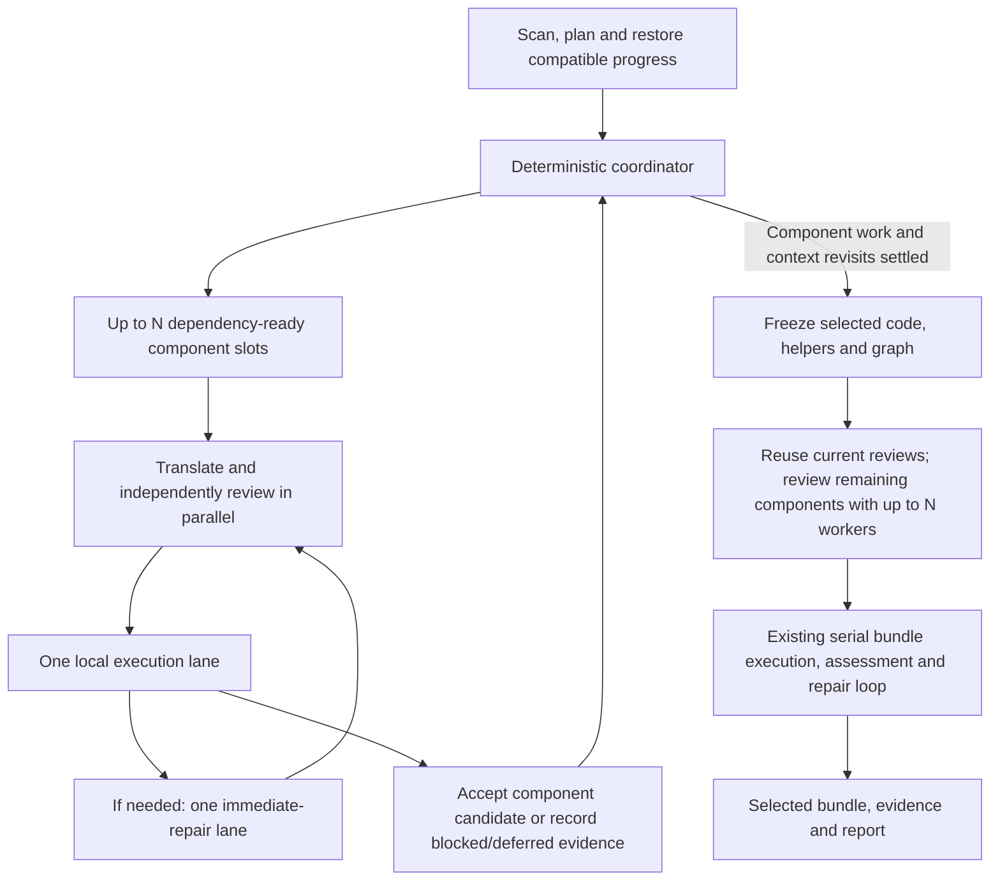

# Parallel SAS translation on the v0.4.5 workflow

State version: 8. Updated: 2026-09-18. Status: staged implementation authorized by the owner and underway on `feat/parallel-translation`. Component concurrency and final-review concurrency are implemented; automatic dependency correction remains the separate step-5 follow-up. Role-equivalent context and capability parity is an explicit user requirement. The design rationale below retains the v6 review history; the implementation status here takes precedence over its future-tense wording.

Baseline: local `DESCRIPTION` version **0.4.5**, branch `pr-31`, commit `268b60d5d82e0ccc8c368de62bc000e258efa84a` ("Consolidate component reviews before bundle execution"). This is the inspected checkout, not a claim about a published release tag.

## Owner checkpoint

The user's requirements remain: translate several SAS programs concurrently, configure the maximum in `_sas2r.yml`, coordinate worker findings and dependency corrections, and improve speed without weakening translation quality.

Selected implementation: extend the existing deterministic R orchestrator with bounded concurrent role jobs in fresh `callr` processes, following the async-first probe and named blocker below. Keep local R execution in one background process lane, immediate repair in one lane, and bundle execution/repair serial. The coordinator alone accepts revisions, changes shared helpers, admits spending against the shared budget, and saves checkpoints. Authoritative graph correction remains part of the separate recovery change.

The most expensive failure is accepting code or evidence against the wrong dependency/helper context. More workers must not weaken source fidelity, review independence, reference separation, execution isolation, or existing repair limits.

Progress: configuration, process workers, parallel final reviews, and dependency-ready component generation/review are implemented. The async probe exposed a request-settings blocker: a scoped 20 ms timeout rejected a synchronous 150 ms replay request, but the equivalent asynchronous request completed after the options scope had ended. Fresh `callr` workers preserve the existing synchronous request settings and conversation lifecycle. This is evidence against the current scoped-options integration, not a claim that ellmer cannot support an alternative async implementation. No second production transport was added. Run-scoped options are a candidate mitigation for a future async integration when all overlapping adapters share a policy. Different translator/reviewer/fixer policies still need isolation and explicit validation; the scoped-options probe alone does not rule out async.

### Implementation status and deliberate limits

- `migration.max_parallel_translations` defaults to 1; the public argument overrides YAML. Reports expose requested/effective workers and any fallback. There is no CPU-count clamp.
- Ready component drafts overlap. One settlement lane retains the existing checks, review, smoke execution, bounded repair and helper-consumer regressions. Draft promotion waits for the entire settlement transaction, a deliberately conservative extension of the proposed short helper-commit freeze. The final review sweep uses a frozen selection; bundle execution/repair stays serial.
- The coordinator owns budget admission, revision selection and checkpoints. The native ellmer tool loop remains intact; no user turn is inserted between tool batches. Invocation-scoped native turns preserve reasoning content and thought signatures into finalization. On ellmer 0.5.0+, public callbacks admit each tool-loop request and explicit admission covers structured output, which bypasses those callbacks. `max_calls` counts these requests in both modes. Older ellmer retains serial phase-level metering and visibly falls back to one workflow; custom adapters without a reconstruction factory also fall back. When both `max_parallel_translations` and `max_tries` exceed 1, preflight and translation stop before provider calls with instructions to set either value to 1; effective argument overrides are honored.
- Fresh workers inherit verified model settings and tested capability records. Optional-setting rejections flow back to the coordinator and onward to workers. Already-admitted peer requests can still discover the same rejection concurrently.
- Version-9 checkpoints save component stages and revisit counts and import compatible version-8 work. Legacy revisit counts remain unknown. Interrupted requests retain unknown costs and strict reservations rather than receiving a speculative refund. A worker crash stops dispatch and drains active siblings before checkpointing and aborting. Manifest revision paths identify original artifacts even when produced in worker directories.
- Preflight reconciles every scanned source file with the translation schedule and existing bundle planner. Known omissions, duplicate components and conflicting component names stop the whole run before provider setup or model calls. Missing resources, dependency cycles and newly discovered dependency identifiers permit provisional drafts while affected execution remains unavailable. Component failures preserve useful work while other components continue. Automatic graph reconciliation and the new reporting tool remain step 5 in a separate follow-up. Until then, the full dynamic-recovery feature is **not complete**.
- Offline validation covers 1/2/3/4 workers, complete fixture output values, chain/fork/join ordering, review payload parity, shared limits, helper rollback, interruption/resume and installed ellmer 0.4.2/0.5.0 replay. The paired live PHUSE pilot has not run. Neither live speedup nor real-model quality equivalence is claimed; the default remains one.

The local implementation record is `docs/local/parallel-translation-implementation.md`. It records check results, the process/polling measurements, review caveats and the outstanding live pilot; it is intentionally excluded from the package.

Review changes: reopen the transport choice; prioritize longer remaining dependency chains among ready components; preserve compatible saved work through an explicit import; separate the new dependency-reporting tool from concurrency changes; reduce the initial paid benchmark to two one-versus-two-worker pairs. The local reviewer response records accepted findings and reasoned pushback.

Round 2 refines the prototype sequence rather than changing the architecture: try async first, specify invocation-bound accounting fixes, explicitly select sequential tools within each conversation, and measure provider latency/throttling in the live pilot. Timing scenarios remain distinct from runtime predictions.

## INV-001 — Preserve each role's information, access, permissions and memory

Requirement status: accepted as an explicit user requirement. Verification status: offline role/context and deterministic-output checks are implemented; provider-native continuation is covered by DeepSeek/Gemini replay tests, while live quality parity remains unproven. A parallel translator must have the same effective capabilities and relevant context as the corresponding sequential translator; likewise for reviewers and fixers. Roles retain their existing differences, including reviewer independence and source-only authoring boundaries.

| Dimension | Required parity |
| --- | --- |
| Information | Same source, component contracts, selected dependency code, helper definitions, schemas, guidance, package facts and permitted evidence for the same role, component, phase and logical project snapshot; same context allocation and truncation policy. |
| Access | Same role tools, source/include/macro search roots, library mappings, allowed packages and effective provider configuration. Equivalent lookups against the same snapshot must return equivalent facts, including absent or unknown results. |
| Permissions | Same permitted role actions and ability to propose program/helper repairs. Worker output locations are isolated and the coordinator accepts shared changes; isolation must not silently remove an existing role capability or broaden access to reference answers. |
| Invocation memory | Preserve the full messages, tool results and continuation state within each existing agent invocation. Do not restart a conversation at each tool response or split an invocation across workers without carrying that state. |
| Project memory | Preserve selected revisions, accepted findings, dependency/helper state, complete applicable evidence history, review identities, repair counts and resume records. Supply the same role-visible portion through the existing context builders and tools. |
| Quality and allowance | Same effective model/reasoning, context/output limits, per-invocation tool/retry limits, repair allowances and review/execution gates; one shared run budget rather than N copies. |

Current `run_agent_impl()` creates a role conversation per invocation; the serial workflow does not give all agents a single shared chat containing every earlier conversation. Durable project evidence and invocation messages are different forms of memory. Preserve both at their existing scopes. Do not introduce a new memory database or copy arbitrary process globals as a substitute for explicit state.

Parity is evaluated at an equivalent logical state, not the same wall-clock time. If a required fact is still being produced, wait rather than supply a thinner packet. If relevant context changes while a worker is running, mark old evidence outdated and follow the context-only recheck or assumption-invalidating retranslation rules below. Before final acceptance, all required evidence must be current for the selected code and its actual dependency/helper context. A pending final review is not a requirement to rerun every translator with all other agents' conversations.

Use the same context/tool construction code in sequential and parallel adapters. Test both the initial request and scripted multi-turn tool continuations on the same snapshot. Require equal role-visible payloads and tool behavior, normalizing only irrelevant transport/job identifiers and equivalent private output locations. Independently check that named source/dependency/helper/evidence facts survive transport; two adapters calling the same wrong builder is not enough evidence. Intentional new tools such as dependency reporting must be identified separately, applied consistently to one-worker and parallel modes, and validated rather than hidden as a concurrency-only change.

Matching context and capabilities is necessary, but does not prove equal-or-better LLM results. Completion order, shared changes, provider variability and competition for a finite run budget can still affect outcomes. The output/evidence comparisons below remain release gates. Never divide existing per-role allowances by worker count to make concurrency appear affordable, promise completion under an insufficient shared budget, or present identical capabilities as a guarantee of semantic correctness.

## What changes from the earlier plan

| Earlier assumption | v0.4.5 evidence | Revised decision |
| --- | --- | --- |
| Re-review earlier components promptly after each shared-context change | Context-only revisits now do local checks/smoke; outstanding semantic review is consolidated before bundle execution | Preserve that consolidation. Do not add repeated model reviews to each helper update. |
| Rebuild downstream translation whenever upstream code/helpers change | Unchanged component content is explicitly distinguished from changed execution/review context | Rebind and locally recheck unchanged code first. Retranslate when source/dependency assumptions are invalid, not for every helper hash change. |
| One worker can simply run the complete component function on a copied state | Component repair can stage a helper runtime and update every earlier consumer | Workers return scoped results. Never merge whole worker state objects into coordinator state. |
| Resume needs basic incremental saving | v0.4.5 already saves component progress, final reviews, and repair counts; checkpoint version is 8 | Extend these checkpoints with scheduling/graph facts; preserve existing review reuse and spent allowances. |
| A 17-component checkpoint offers 17 parallel reviews | Matching reviews are reused; the inspected PHUSE run had only one fresh checkpoint review | Use checkpoint concurrency as scaffolding, then deliver the speed improvement in component processing. |
| Reference mismatches can be general repair evidence | Source-faithful repair and source-only context are now explicit contracts | Keep reference answers out of workers' authoring/review tools and prompts. A mismatch alone never authorizes a code change. |

The prior proposals D3 (scheduling), D5 (branch recovery), and D7 (resume) are superseded by their v0.4.5 revisions below. Their original intent—ordered dependencies, current evidence, bounded recovery—remains. The earlier diagram slot counts are illustrative historical schedules, not a v0.4.5 speed estimate.

## Verified v0.4.5 baseline workflow

1. Scan sources, called macros, libraries and output contracts; build the stable dependency schedule.
2. Process components serially. Generate a revision, run mechanical checks, independently review it when mechanically valid, perform applicable smoke execution, and use bounded immediate repair when warranted.
3. A new or actually repaired component receives semantic review. A later context-only revisit of unchanged code refreshes its binding and runs local checks/smoke without restarting the agent loop.
4. Shared-helper candidates retain the previous runtime until candidate checks succeed. Earlier consumers receive local regression checks; their pending semantic reviews are consolidated.
5. `finalize_component_reviews()` reuses matching completed reviews or obtains outstanding reviews. It makes no code/helper changes and invokes no fixer. It saves progress after each review.
6. The bundle pipeline executes a full attempt, assesses outputs and evidence, diagnoses failures, performs bounded source-grounded repairs, and freshly executes subsequent attempts. Existing selection rules retain a better prior selection when a candidate regresses.

Current evidence and useful integration points:

| Capability | Code anchor | Constraint on parallelism |
| --- | --- | --- |
| Component loop and targeted revisit | `R/orchestrate.R`: `process_program_component()`, `run_program_pipeline()` | Preserve actual-repair versus context-only paths and three-revisit limit. |
| Review checkpoint and smoke reuse | `R/component-checkpoint.R`: `review_component_revision()`, `smoke_component_revision()`, `finalize_component_reviews()` | Review request identity and smoke execution identity are distinct. |
| Shared runtime | `R/helper-overlay.R`: `stage_helper_candidate()`, `check_helper_consumers()` | Current helper changes rebind all selected components; assume this broad effect until proven otherwise. |
| Review identity | `R/agent-review.R`: `review_program_revision()` | Reuse only the current compatible completed review; never restore an old clean verdict over later adverse/unavailable evidence. |
| Source context | `R/agent-guidance.R`, `R/agent-translate.R`, `R/source-repair-policy.R` | Preserve paired SAS/R dependency context, package facts, source projections and reference separation. |
| Bundle repair | `R/bundle-repair.R`, `R/orchestrate.R`: `run_bundle_pipeline()` | Keep integration review, helper regression checks, causal priority and full execution acceptance. |
| Usage | `R/usage-ledger.R`, `R/runner.R` | Mutable run-wide budget and process-local managed-attempt callbacks cannot be shared by copying them. |
| Resume | `R/migration-resume.R` | Version 8 saves selected revisions, histories, helpers, repair counts and diagnostics, but not an effective dynamic graph or in-flight jobs. |
| Configuration | `R/config.R`, `R/translation-setup.R` | `migration` remains accepted in raw YAML but absent from normalized `sas_config()` output. |

### Current PHUSE workload

Re-ran the actual configured entry point offline:

```r
sas_preflight("test_project_phuse/programs",
              config = "test_project_phuse/_sas2r.yml")
```

Result: **17 scheduled components: 3 programs and 14 called macros; zero unresolved schedule entries; zero model calls.** The overall preflight status is nevertheless **`needs_attention`**: scanner findings include unverified macro expansion, a dynamic dataset reference and deferred macro data flow. All four configured references are present; their presence does not establish their compatibility or correctness. Do not equate an empty unresolved-edge list with a completely known dependency graph.

The program chain remains `derive_adsl -> derive_advs -> WPCT-F.07.01`; the figure also consumes the macro dependency branches. Independent macro translation can overlap program translation. Four workers cannot remove the serial dependency chain or the serial bundle stage. Scan only the configured program entry point; recursive scans include unused definitions and generated copies.

### Timing evidence and limits

Read the existing serial run `test_project_phuse/migration_output/run_20260917T203204Z_6fcbd75c`; no new provider calls. Fable's log-gap attribution estimates about 192 minutes overall: 182.5 in component processing, 6.94 in the final checkpoint review, and the remainder in bundle work and overhead. These are approximate stage allocations from completion timestamps, not instrumented durations. The checkpoint's two LLM rows belong to **one invocation**, whose gathering and finalization requests are sequential. More checkpoint workers would not overlap that invocation with another fresh review in this run.

An independent offline schedule calculation reused those component durations and manifest dependency closures:

| Slots | Stable run-order priority | Remaining downstream chain height, stable ties |
| --- | --- | --- |
| 1 | 182.5 min | 182.5 min |
| 2 | 121.7 min | 105.3 min |
| 3 | 106.5 min | 83.0 min |
| 4 | 83.3 min | 74.8 min |

These are **optimistic component-stage scenarios**, not measured parallel performance or guaranteed upper bounds. They omit repair/execution contention, rate limits, process overhead and context invalidation; observed LLM durations can change. The weighted critical path in this model is 74.8 minutes. Fable's 104.5/84.7/79.2 alternative uses accumulated *upstream* duration, not remaining downstream height; its numerical gain does not directly validate the proposed structural heuristic. The independent downstream calculation supports trying that general heuristic, with ordinary fixtures and live validation still required. No historical durations become scheduler inputs in the first release.

For plain-language discussion, describe the chosen height heuristic as **about 105 modeled component-stage minutes with two slots**, versus about 122 with stable priority, under the same optimistic assumptions. Do not present 101–105 minutes as an expected runtime or uncertainty range: 101.3 comes from a different, duration-weighted heuristic that uses this run's observed timings. Actual parallel time has not been measured and can lie outside those scenario values. Keep exact table entries only for reproducibility.

## D1 — Configuration and resource policy

```yaml
migration:
  max_parallel_translations: 2
```

- Default **1**, preserving sequential operation. A user-configured value is a ceiling, not a promised number of busy workers.
- Use the owner-approved name `max_parallel_translations` (renamed from the draft thread/worker terminology). Public help must define it as concurrent translation workflows, not native CPU threads; do not add a competing `max_workers` alias.
- One finite positive whole R integer; reject malformed explicit values before creating workers or provider calls. Normalize YAML, R-list configuration and reused projects through one function.
- Add `sas_translate(max_parallel_translations = NULL)` with explicit argument > normalized configuration > default. Preflight shows the configuration-derived ceiling. No alias or second public concurrency knob in the first release.
- A slot represents a component workflow during the component stage, or one outstanding review during the final checkpoint. Translator, reviewer and fixer steps within a component are sequential and share that slot. The stages do not run simultaneously.
- At most N authoring/review role invocations and N provider attempts are active within a run configured with N slots. A waiting component keeps its slot unless it yields for an unresolved dependency. Logical workers may share the coordinator process or use child processes; the isolated execution subprocess is not an extra translation slot. Limits also cover adapter-managed requests inside tool loops.
- Establish a one-workflow baseline, then evaluate two on a two-CPU workbench. More remote-LLM workflows may help while waiting for responses, but CPU count, memory and provider limits still matter. Do not reject or silently clamp `4` solely because two CPUs are allocated; recommend it only after measuring that workload.
- Keep one local execution job at a time initially. This is a job limit, not proof that BLAS or another library uses only one native thread. Measure total CPU and memory use; retain the workbench's own resource limits.
- Report requested/effective maximum, observed CPU allocation or unknown, peak worker count, memory where measurable, and waits by dependency, repair, execution and provider admission. Do not invent an automatic memory threshold or add adaptive resizing in version one.
- Only `max_parallel_translations` gains new execution meaning. Do not silently activate other unused `migration` fields. Concurrency alone must not alter scan, translation, review or smoke identities.

In particular, `source_review_config()` currently hashes remaining configuration after removing selected nonsemantic fields. Explicitly exclude the new concurrency setting there and in any relevant identity builders; otherwise changing worker count could needlessly invalidate reviews even with identical role-visible information.

## D2/D3 — Coordinator and concurrent role jobs

Use the existing local R process as the coordinator. Logical workers are bounded role conversations, not necessarily OS processes. Try separate asynchronous conversations in this process first; retain fresh `callr` role processes as a conditional alternative. Both designs use the same coordinator state machine and a background `callr` execution lane. Select one production role transport through D8's staged spike; do not build both merely to complete a comparison table. No additional LLM manager, broker, database or remote worker service is required.



### Component-stage scheduling

Keep `stable_dependency_schedule()` as the source of dependency validity, cycle groups and stable ordering. Known cycles produce preflight warnings and provisional drafts in stable source order within the cycle; execution remains unavailable until the order is resolved. For N>1, rank only ready components by longest remaining downstream chain: `height(component) = 1 + max(height(consumer))`, with leaves at 1 and stable schedule order breaking ties. N=1 retains today's order. In the planned dynamic-recovery follow-up, recompute heights after an accepted graph correction; an unresolved cycle discovered after work starts defers its affected branch and blocks full-bundle execution. Do not prioritize a consumer before its prerequisites. This heuristic can reduce idle tail time but is not universally optimal, and under a scarce shared budget priority can affect which work finishes.

A component waits for its required providers to have selected candidates and settled immediate processing, with known interfaces and no unresolved material provider-identity finding. Never read half-written provider artifacts.

A selected provider can remain provisional pending the final review checkpoint. Do **not** require that checkpoint to finish before starting consumers: it runs after component translation and such a rule would deadlock the design. Likewise, a macro whose smoke test legitimately waits for a supported caller need not pass an artificial standalone execution before its caller can be translated. Preserve existing blocked/deferred handling and evidence; known failures never become successful readiness claims.

Dispatch all roles against a fixed snapshot of source, selected dependencies, helpers, configuration, package facts and model settings. Preserve the existing context construction and ordering limits. Adding workers must not shrink prompts or remove dependency bodies.

Keep one component state machine for N=1 and N>1. Extract dispatch/result-acceptance boundaries from the current loop and reuse existing generation, check, review, smoke and repair logic. The coordinator advances a component between phases; each concurrent invocation performs one bounded role operation. A component slot remains assigned across those operations. Preserve the existing one-worker path for custom/mock LLMs that cannot support the chosen parallel transport, with requested/effective concurrency and the fallback reason shown before provider calls.

Return a scoped candidate or review event, not a replacement `sas2r_migration_state`. The coordinator applies results to current component history; a worker's old snapshot must never erase another worker's progress, repair counts or diagnostics.

The execution lane must also return control to the coordinator while R runs. Adapt the existing isolated executor behind a background execution job, preserving its library setup, diagnostics and hashes; do not block the coordinator in a synchronous smoke call while LLM workers need admission replies. Test simultaneous execution, progress delivery and provider/tool admission explicitly.

### Shared helpers and immediate repair

Initially allow **one immediate repair transaction at a time**, even when several translation/review slots are active. Hold that lane through the fixer, candidate checks/review/execution, consumer regression checks and final acceptance or rejection. Releasing it as soon as the fixer returns would permit the next candidate to use an obsolete helper base. Translation and initial review of unrelated components may continue against their assigned snapshots.

This handles a real supported helper-edit path, not an assumption that helpers change frequently. The inspected run's 24 review records contain one helper hash, and its nine candidate helper files match the stock runtime after the normal version-comment substitution in `R/emit-helpers.R`. Keep existing helper-change regression fixtures and measure accepted helper changes, blocked time and discarded work. Serial repair reduces merge complexity; it does not remove the need to reassess already-running translations and reviews.

For a repair candidate, preserve v0.4.5's sequence: mechanical checks, independent review, applicable execution, then regression comparison. A helper edit uses the assembled candidate runtime for all those steps. Run `check_helper_consumers()` against retained state using the single execution lane before committing it. Do not publish the helper path while those checks are pending.

During the short selection/rebinding operation, the coordinator pauses new dispatch and result promotion. In-flight responses may finish and are buffered. After accepting a helper change, refresh all currently selected components as the existing helper machinery requires; older in-flight results must be reassessed against the new context. Unchanged earlier code receives local checks/smoke and pending final review, not repeated immediate model reviews. Rejecting a candidate restores the retained runtime and selections while preserving the attempted repair's cost, counter and diagnostics.

Do not automatically apply a helper proposal prepared against an obsolete base or merge overlays from two snapshots. Re-enter the existing bounded repair process with current context if allowance remains; otherwise defer with the concrete reason. Rejected or stale work does not receive a fresh repair allowance.

### Final review checkpoint

After all component work and local revisits settle, freeze the effective graph, selected code/contracts, helper runtime and review configuration. There are no fixers, graph promotions or code/helper edits during this sweep.

1. Use the existing reviewer entry point in `reuse_only` mode to identify reusable completed reviews.
2. Assign only missing/current-context reviews to the same N-slot pool. Upstream/downstream code is now fixed, so review ordering does not require the translation dependency sequence.
3. Have the coordinator append each result to current history, promote compatible smoke evidence where allowed, and checkpoint it. Never replace whole histories from a worker return.
4. Retain findings and unavailable reviews. Completing the sweep means every required component has a recorded disposition, not that all reviews passed.
5. Send source-supported repair findings into the existing bundle repair process. Keep bundle-specific integration review and fresh execution; a program-phase checkpoint review cannot automatically substitute for a bundle-phase review with different context.

If a checkpoint reviewer reports a material dependency correction, retain the finding and finish or cooperatively drain active reviews, then reconcile outside the frozen sweep. Reopen affected component work and perform the necessary current-context reviews afterward. Reuse unaffected reviews whose exact identities still match; apply the same bounded revisit limits. Never mutate the graph in the middle of a supposedly frozen checkpoint.

### Authoritative bundle stage

Retain serial `run_bundle_pipeline()` behavior: fresh full execution, bounded diagnostic isolation, source-grounded repair queue, independent candidate review, regression checks and fresh acceptance execution. An isolated diagnostic run is not a replacement for the full bundle run.

Reference comparisons remain local evidence. A reference mismatch can trigger the existing bounded source-focused review, but cannot supply desired values or authorize a code change by itself. Preserve distinctions among every attempted bundle, execution of the current revision, the selected bundle and the current run's status.

## D4 — Worker contract and communication

Every transport uses assignment identity, immutable role-visible input, isolated conversation/continuation state, scoped results and coordinator-only acceptance. Resolve effective capabilities once per applicable configuration; do not repeat paid startup probes per worker. Test tools against the assigned graph snapshot even when the coordinator accepts a correction before the next tool lookup.

**In-process async candidate:** use separate ellmer chat objects for concurrent conversations, with no overlapping requests on the same mutable chat. Preserve complete invocation history through the existing gather/finalize phases. The coordinator admits requests and accepts results through ordinary local calls; promise continuations carry explicit invocation/request context. Avoid IPC files for control messages. Blocking retry sleeps become nonblocking timers with the same delays and limits. Measure synchronous source lookup, parsing, checks and callbacks for event-loop stalls; asynchronous syntax does not make these operations nonblocking. Explicitly pass `tool_mode = "sequential"` to `chat_async()` (and to `stream_async()` if used); its default permits concurrent tools. Preserve tool ordering, limits and result pairing within each invocation while separate conversations overlap. Test this with ordered tool calls and continuation history, rather than infer parity from the argument alone.

**Process candidate:** use fresh `callr::r_bg()` role processes and assignment-scoped atomic messages, one writer per direction. Verify installed-package loading, `.libPaths()`, configured allowlists and effective provider settings. Construct clients locally from serializable nonsecret settings and the existing authentication mechanism; do not put API keys, secret headers, live chat objects or open connections in persisted assignments. Redirect stdout/stderr to per-assignment diagnostics to avoid undrained-pipe blocking. The coordinator alone writes canonical usage/checkpoint/report records; ordinary stdout is not a control channel.

Both candidates use unique run/assignment output paths, for example `<run_dir>/workers/worker_<slot>/assignment_<id>/`, including temporary files. Assignment identity plus message sequence is sufficient; timestamp/PID/UUID combinations are not a requirement. Publish completed files atomically and retain live assignment paths during pruning. This prevents actual concurrent-write collisions; it does not create a new security sandbox or solve arbitrary external package lock contention.

| Message | Required purpose |
| --- | --- |
| Assignment | Run/job/component/phase identity, base revision and helper/context bindings, immutable input packet, candidate paths, read-only limits |
| Progress | Existing phase event with component/job identity; no invented completion percentage |
| Dependency finding | Observed producer/consumer/library or macro relationship, source location, evidence and uncertainty |
| Attempt/tool admission | Invocation/request identity and existing reservation inputs, including adapter-managed subattempts; a local call for async or a message for child processes |
| Grant/defer/deny | Coordinator decision and precise capacity/budget reason |
| Result/failure | Candidate paths or review record, base identities, usage receipts, exit/diagnostic details |
| Cancel at boundary | Stop before further requests or mutation; account for any already-started request |

The coordinator must service admissions and results while any job waits or local execution runs. Require progress delivery within one second in the offline spike. For the process candidate, start measurements at 250 ms polling; record end-to-end admission latency and event-loop/CPU cost, and compare 25–50 ms polling only if admission delay is consequential. Change transport or polling based on measured delay, not an assumed per-tool penalty. Do not add sockets, FIFO infrastructure or batches of pre-granted tool calls in version one. Read-only tools still consume existing allowances; batching introduces unused-quota and attribution rules without demonstrated need.

Existing discovered/suspected dependency output fields remain. Deliver the narrow `report_dependency_finding` tool and dynamic reconciliation in a **separate follow-up PR** after component concurrency. Evaluate the tool in one-worker mode as well as parallel mode. It reports evidence and cannot edit the authoritative graph. Its role declaration changes worker policy and can legitimately invalidate older checkpoints; document that cost separately from changes to concurrency alone. Until dynamic recovery ships, material uncertain findings remain attached to affected drafts and defer execution; they do not cancel useful translation.

## D5 — Dependency correction and affected branches

Preflight and recovery during translation have different scopes. A known invalid
pipeline, including a dependency cycle, stops the whole run before provider setup
or model calls so the user can correct it before translation starts. Findings
first discovered during translation defer the affected branch while independent
work continues; full-bundle execution remains blocked. Source-confirmed graph
correction and reassignment below remain the separate step-5 follow-up.

Use the existing graph/resolvers and source semantics as authority. Accept a correction only when source evidence establishes the relationship: for example, a uniquely bound producer of the library/member actually read by the consumer. Confidence scores, filenames, an invented R helper call, reference answers or a mere runtime name match are insufficient.

Discover additional macro components only through the configured source/include/macro paths and existing scanner. Removing or rebinding an edge needs positive source evidence; absence of a call from generated R is not sufficient. Unsupported dynamic forms remain unresolved rather than introducing a general SAS interpreter.

The coordinator owns one effective graph. Keep `state$graph`, the project graph used by guidance/reviewer/tools, the derived schedule, dependency closures and source-derived lineage views consistent when accepting a change. Updating only the ready queue would leave models reasoning about a different graph.

| Change class | Recovery |
| --- | --- |
| Selected dependency R code or shared helper changes; consumer code/contracts remain applicable | Existing context-only rebind, mechanical checks, identity-aware smoke; semantic refresh at the checkpoint. No automatic retranslation. |
| Confirmed missing/wrong producer or contract makes the consumer's translation assumptions invalid | Pause consumer and descendants; resolve provider, regenerate affected translation with corrected context, then normal review/smoke/repair. |
| Only reviewer facts change | Recompute full review identity and refresh required reviews; do not label this a translation change. Existing resume compatibility still applies. |
| Source/input files change | Follow existing fingerprint invalidation/rescan rules. Do not silently mix source/input versions to keep workers busy. |
| Dynamic identity, missing source or ambiguous writer cannot be established | Continue demonstrably unaffected work; defer the affected branch with source locations and the missing fact. |
| Cycle known during preflight | Stop the whole run before provider setup or model calls; report the cycle and require correction before translation. |
| Cycle first discovered after translation starts, without an established resolution | Keep the cycle visible and defer its affected work while independent work continues; block full-bundle execution. Running one worker does not solve a dependency cycle. Dynamic graph reconciliation remains planned. |

On a confirmed correction, compute affected consumers using old and new relationships, pause their admissions, recompute bindings and schedule, then checkpoint before dispatch under the new plan. An unrelated graph revision is not by itself grounds to discard a valid result. Affected late results remain diagnostic artifacts and cannot become current evidence simply because they finish later. Unchanged code from an obsolete snapshot can be reassessed through existing checks/review rules; old evidence is never relabelled current.

Known chains run in dependency order; unaffected branches continue. A shared-helper change currently affects all selected components, so broader pause/rebinding is appropriate there. Preserve the three-revisit hard limit and existing program/bundle/cost/request limits across reassignment and resume. No guessed ordering to manufacture success; no resets of spent allowances.

## D6 — Central accounting and quality boundaries

All real provider attempts, managed adapter retries, capability probes and counted tools use the coordinator's existing usage ledger and admission rules. Async jobs call it in-process; child processes use an admission client, never copied budgets. Admission checks and reservation updates finish without yielding between them. Per-agent reporting uses invocation/request attribution, replacing the current difference between global counters at entry and exit.

Same-process execution does **not** make current accounting async-safe by construction. `R/usage-ledger.R` uses process-global `.usage_attempt_scope` callbacks/tool audit context with synchronous `on.exit()` restoration; `attempt_usage_transport()` immediately normalizes and reconciles its return. `R/llm.R::with_ellmer_limits()` similarly scopes global options synchronously, and `R/runner.R` uses blocking retry sleeps and global-counter deltas. A promise can settle after these scopes have ended or after another invocation has run. The async spike must show request-bound callbacks/audit data, correct success/error/cancellation reconciliation, and unchanged effective timeout/retry settings across interleavings. Carry internal accounting context separately from provider-visible payloads, as today. Do not keep one mutable global callback across a suspended request. If ellmer captures an option before yielding, establish that against supported versions rather than assume it.

The async candidate must demonstrate these three concrete changes:

| Change | Implementation direction | Offline evidence |
| --- | --- | --- |
| Invocation-bound metering and tool audit | Create a wrapper per invocation that captures its metering callback and audit context, then derives each request/subattempt's identity. Pass those bindings through adapter continuations and tool closures instead of reading a mutable package-global scope after yielding. Normalize and reconcile when the promise settles, including rejection/cancellation. | Interleave two invocations, retries and tools; each receives only its own context and each reservation has one terminal accounting disposition. |
| Captured timeout/retry settings | Establish when every supported request path captures settings, including later rounds of a native tool loop. Prefer settings captured into the actual request through supported interfaces. Scope options only around a proven non-yielding construction step; never leave different invocation settings globally installed across waits. If no supported path preserves this, record an async blocker and evaluate the process fallback. | Build/interleave requests with different settings and verify each effective timeout/retry policy, including a request created after a tool response. Do not assume arbitrary fields added to a chat object affect transport. |
| Per-request cost receipts | Attribute settled receipts to their invocation/request IDs and aggregate those receipts for invocation reports. Retain one shared run ledger; remove overlapping invocations' dependence on global entry/exit counter differences. | A finishes before/after B under both orders; its reported usage includes only A's receipts. Retry costs and unknown outcomes retain their existing categories. |

Read-only inspection of installed ellmer 0.5.0 shows `ellmer_req_robustify()` captures timeout/retry options into an HTTP request when that helper runs. An offline request built with 17 seconds/two tries retained those values after globals changed to 29 seconds/four tries. No HTTP request was sent. This narrows the uncertainty, but does not establish when every async provider/tool-loop path calls the helper, or prove behavior on ellmer 0.4.2; those remain spike checks.

The managed callback path in `attempt_llm_request()` is a release blocker for the transport spike: an adapter may perform several billed attempts inside one apparent call. Reserving once for an entire agent conversation is insufficient. Preserve strict/soft/observe semantics, output ceilings and known/estimated/unknown usage categories. Consume and checkpoint fixer allowances before dispatch, as v0.4.5 already does before invocation.

Provider throttling queues/backoffs through existing policy. It must not lower the model/reasoning, truncate context, remove tools or skip review. A started request with an unknown outcome remains unknown on cancellation or worker crash; no fabricated refund or automatic uncounted retry.

Distinguish temporary capacity held by in-flight reservations from a definitively exhausted allowance. When completion/reconciliation could release capacity, defer admission and reconsider it after that event; do not prematurely label every waiting component budget-exhausted. Preserve the existing conservative treatment of unknown outcomes and never grant beyond the reservation rules.

Workers receive the same role-specific source-visible context as the serial workflow. Keep reference paths/answers, comparison results and local-only observations excluded where current authoring boundaries exclude them; do not serialize the whole run report into a job. Preserve reviewer independence from translator reasoning. Generated R retains the existing execution boundary; process separation is not a filesystem security sandbox. No new service or credential store is introduced.

## D7 — Resume, failure and observability

Extend the current `resume.rds` authority without throwing away compatible selected work merely because concurrency was added. When authoritative graph/job/revisit state requires a new schema, pair the version bump with a **narrow one-way version-8 import**, not blanket invalidation. Verify a legacy checkpoint using the legacy fingerprint recipe/version and the existing artifact and policy checks before converting it. Do not compare its version-8 digest directly with a new-version digest and call it incompatible.

For a compatible version-8 import, retain selected revisions, histories, helper contents, repair counts and diagnostics; derive the initial graph from the matching source scan; there are no persisted concurrent assignments or accepted dynamic corrections to replay. Preserve completed evidence only under its normal current identity. Version 8 did not persist component revisit consumption: record that as unknown, not zero. Reuse its completed work, but defer automatic recovery that requires proving a remaining legacy revisit allowance. Preserve every known spent allowance. Incomplete work requires the existing usage evidence to be reconciled before new requests.

New authoritative graph corrections must not be silently ignored by an old reader. Write the new schema once that state is used so the version-8 reader's existing version check rejects it; downgrade must not accept old selections under an uncorrected graph. No bidirectional compatibility bridge is planned. If source, role tools/prompts or evidence policy really changed, retain explicit invalidation/regeneration diagnostics and the extra-call warning. The separate dependency-tool PR may cause this legitimate policy invalidation even with a schema importer. A package release number or worker-count change alone is not an invalidation reason.

Persist selected revisions, evidence histories, helpers, repair counts and diagnostics as today, plus accepted effective graph facts, their source justification, current phase, pending/in-flight assignments and dependency-revisit counts. The graph/schedule in reports are derived views of this state, not a second authority.

Separate the initial source/configuration fingerprint from accepted graph corrections. Restore only after checking the original compatible inputs, then rebuild/validate derived views from the saved effective graph. Keep concurrency and assignment IDs outside semantic translation/review/smoke identities. Reuse each completed review only under its current full request identity, not merely component ID or code hash.

Checkpoint each accepted component, each accepted checkpoint review, accepted graph/helper changes, and repair admission milestones. Interrupted incomplete work returns to pending or deferred after request accounting is reconciled. Keep current run-scoped attempts and add assignment scopes so simultaneous or late attempts cannot overwrite one another. Normal artifact pruning must not remove files referenced by a live assignment.

On failure, preserve component/phase/base revision, available stderr, request IDs and the reason; stop relevant admissions before cleanup. Observe promise failure/cancellation or child exit, and do not release capacity while its provider attempt can still be active. A child slot is released only after process exit; unresolved paid outcomes stay unknown. Parent supervision still applies to the background executor whichever role transport wins. Unavailable review remains unavailable, and a failed required branch prevents a whole-bundle success claim even when unrelated components finish.

Show workers' current components/phases, dependency waits, resource/admission waits, helper changes, context-only revisits, reused/new/unavailable checkpoint reviews, stale results and preserved counters. Keep source/execution evidence distinct from reference comparison status.

## D8 — Technology choice and deferred scope

| Option | Decision and reason | Revisit trigger |
| --- | --- | --- |
| In-process asynchronous role conversations; background `callr` executor | Provisional first choice if the spike proves explicit per-invocation context/accounting and responsive tool/retry behavior; avoids role-process IPC and repeated package loads | Reject or defer if supported adapters cannot yield, callback/option isolation fails, or local blocking prevents the responsiveness gate |
| Fresh `callr` role processes; same background executor | Conditional fallback using an existing dependency; keeps synchronous role internals but requires admission IPC and client reconstruction | Prototype only for a named async blocker that process isolation can plausibly address; require the same hard gates and measure startup, memory, polling and cancellation |
| Adopt `targets`/`crew` as a new top-level engine | Defer; useful general execution infrastructure, but replacing sas2r's revision/repair state adds another migration | Revisit if multi-machine operation becomes a concrete requirement |
| Add an LLM orchestrator | Do not adopt; existing roles can report findings while code owns deterministic scheduling/acceptance | Revisit only for a distinct semantic task existing roles cannot perform |

Primary references checked 2026-09-17: [ellmer async sessions](https://ellmer.tidyverse.org/articles/streaming-async.html), [ellmer Chat APIs](https://ellmer.tidyverse.org/reference/Chat.html), [promises](https://rstudio.github.io/promises/articles/promises_03_overview.html), [later](https://later.r-lib.org/), [callr background processes](https://callr.r-lib.org/reference/r_bg.html), [targets/crew execution](https://books.ropensci.org/targets/crew.html), [allocation-aware CPU detection](https://parallelly.futureverse.org/reference/availableCores.html). The ellmer documentation explicitly supports concurrent sessions and requires separate mutable chat objects. R's single interpreter does not require one OS process per network wait.

Installed: ellmer 0.5.0, callr 3.7.6, promises 1.5.0, later 1.4.8, parallelly 1.46.1. The [ellmer changelog](https://ellmer.tidyverse.org/news/index.html) places async `tool_mode` support in 0.2.0, before the declared sas2r floor of ellmer 0.4.2. API-history uncertainty is therefore narrowed; full minimum-version behavior, callback support and option scoping remain untested. In particular, per-model-request start/end callbacks are documented as a 0.5.0 addition, so the spike must not silently require them while claiming 0.4.2 support. Test the supported-version contract or propose an explicit dependency change before adoption.

Installed ellmer already imports promises, later and coro. Declaring direct use in sas2r introduces no new package names in this environment; it is still required package metadata, and any chosen minimum versions may affect other installations. No upgrade is assumed. `parallelly::availableCores()` remains a candidate for allocation reporting, not an automatic cap; unknown allocation stays unknown.

**Stage A: one engineering day for async first.** Exercise two actual async conversations through the proposed runner/adapter boundaries using fake provider responses and existing contract fixtures. A pair of unrelated delayed promises is not sufficient evidence. Hard gates: identical role-visible context and multi-turn history; independently scoped callbacks/settings; exact managed-attempt/tool admission and reconciliation; no over-admission with a one-request allowance; progress within one second while a provider and executor wait; correct cancellation/failure status. Measure installed-library loading, peak memory, admission latency, event-loop stalls and elapsed time. If all gates pass, select async without building the alternative merely for comparison.

**Stage B: at most one additional engineering day for callr, only if justified.** A named async blocker must identify a gate and a plausible way that process isolation resolves it, such as unavailable request-scoped settings or unavoidable blocking in a required adapter. Reuse the same fixtures and gates; also measure process startup, serialization, polling and cleanup. Select it only if all gates pass. Expiring Stage A's timebox is an inconclusive result, not proof that async failed or permission to start an open-ended alternative. Record missing evidence and the maintainer's bounded next step; retain one-worker operation until a candidate passes. No automatic timebox extensions, second framework or weakened gates.

A synchronous custom adapter wrapped in a resolved promise still blocks before the promise exists. Preserve its one-worker compatibility; parallel eligibility requires a genuinely yielding adapter or the validated process transport. Process separation removes neither adapter reconstruction risk nor output validation; shared memory removes IPC but not per-request attribution risk.

Deferred: parallel bundle execution/repair, concurrent immediate fixers, persistent worker reuse, remote machines, adaptive worker counts, arbitrary SAS dependency interpretation and an automatic memory controller. Revisit persistent processes only if measured process startup/serialization exceeds 10% of total time; revisit concurrent repairs only after profiling demonstrates that lane is a bottleneck and shared-helper correctness has a bounded design. The package maintainer owns these revisit decisions.

### Article review: parallel translation and subagents

Read [the supplied chapter on subagents and asynchronous execution](https://didilili.github.io/ai-agents-from-zero/#/实战项目-深度研搜/3-子智能体进阶与异步执行) and checked its linked framework documentation on 2026-09-17. The chapter demonstrates delegated specialists, isolated conversations, streamed events and overlapping independent top-level requests using Python async execution. Its example is not a dependency-aware SAS migration scheduler or evidence of unchanged translation quality.

Parallel translation describes execution timing: multiple eligible component workflows overlap. Subagents describe delegated responsibility: a role performs a bounded task with its own instructions, tools and conversation. Subagents can run sequentially; concurrency can run plain functions without subagents. Neither term determines CPU-thread count, memory inheritance or persistence. sas2r already has translator/reviewer/fixer roles with those basic agent boundaries; the proposed change is concurrent execution of these existing workflows with coordinated state.

Borrow or strengthen these mechanisms within D2–D8:

| Pattern | sas2r application |
| --- | --- |
| Encapsulate an existing workflow | Use the current role configuration, context builders, tool loop and schemas inside each job. Do not replace the v0.4.5 workflow with a short delegation prompt or a second agent framework. |
| Explicit context contract | Materialize role-visible information and capabilities through the same code in one-worker and multi-worker modes. INV-001 tests initial requests and multi-turn tool behavior, not just model names. |
| Nonblocking task lifecycle | Coordinator dispatch returns an assignment ID; progress, result collection and cancellation operate on that identity while other jobs advance. These are internal coordinator operations, not additional LLM calls to supervise each poll. |
| Durable task records | Store job/component/role/base-context identity, status and result location in existing coordinator/checkpoint state, separate from conversational text. Keep process completion distinct from evidence acceptance. |
| Structured result handoff | Return full candidate artifact references, findings and evidence IDs. A concise progress summary must not become the only surviving account of code, dependencies or review findings. |
| Bounded delegation | Keep a flat coordinator-to-role-worker structure initially. Parsing, dependency queries and mechanical checks remain ordinary tools/functions. No worker may spawn uncounted nested agents or obtain a separate run budget. |

The current [DeepAgents subagent documentation](https://docs.langchain.com/oss/python/deepagents/subagents) distinguishes isolated context from explicit conversation forking and documents field-specific inheritance. This does not establish sas2r parity automatically. Forking a supervisor conversation could expose the wrong role's reasoning while still failing to reproduce the sequential role's exact context. Prefer explicit role snapshots and existing project evidence; do not add global conversational memory.

The [async subagent documentation](https://docs.langchain.com/oss/python/deepagents/async-subagents) illustrates task lifecycle controls and durable metadata separate from message history. Adapt that separation to existing local state; adopting its server protocol or interactive LLM supervisor is unnecessary here. Python's [task documentation](https://docs.python.org/3/library/asyncio-task.html) also distinguishes overlapping waits from CPU execution. In R, evaluate ellmer's async conversation APIs alongside the process alternative; keep blocking generated-R execution in the background executor under either design.

An LLM dependency-investigation specialist is deferred. Revisit only if benchmark failure triage shows multi-step source investigation repeatedly exceeds what existing roles and tools handle. Any experiment would be available consistently in one-worker and parallel modes, limited to one invocation per unresolved source/context finding within the existing run allowance, and return cited observations for coordinator validation. It would neither replace required review nor decide graph order or acceptance.

Validation additions: a completed-but-rejected job must not appear accepted; task recovery must work without using a progress summary as state; all role invocations share the configured concurrency and usage ceilings; ordinary deterministic checks must not acquire new model calls. No DeepAgents/LangGraph dependency, new specialist role or additional provider call was added by this review.

## Implementation sequence

| Step | Deliverable | Acceptance gate |
| --- | --- | --- |
| 1. Async-first offline feasibility spike | Two async role jobs through the real integration boundaries, fake providers and one background executor; one engineering day. A process fallback gets a separate one-day cap only for a named blocker it can address | D8 hard gates pass; measure memory, admission delays and stalls; select async if it passes. Do not build a losing transport just to compare; inconclusive evidence remains explicit |
| 2. Configuration and shared execution interface | Normalize max_parallel_translations; preflight/reporting; shared role lifecycle and parity harness; resume compatibility/import where needed | Default-one preserves v0.4.5 fixture behavior, identities, limits and compatible progress; chosen transport preserves context, tools, continuation and permissions; invalid config fails before calls |
| 3. Parallel checkpoint reviews: integration scaffold | Freeze snapshot, reuse reviews, dispatch outstanding jobs, apply/checkpoint scoped results; no new role tools | Fixed-response 1/2/3/4 fixtures preserve dispositions; a fixture with several outstanding reviews demonstrates overlap; zero/one-outstanding cases do not make speed claims; interruption retains completed work |
| 4. Parallel component processing: speed deliverable | Ready-component priority by remaining chain height; one execution lane and one complete repair transaction; coordinator-only selection | Chain/fork/join readiness; measured overlap; no shared-state loss/stale promotion; helper rollback preserves retained state; evaluate end-to-end speed here |
| 5. Separate dependency-tool/recovery PR | Evaluate new tool in sequential mode first; deterministic reconciliation, affected-only rescheduling, durable graph and revisit counts; document policy-hash change | All graph consumers see corrections; invalid assumptions regenerate affected code; context-only changes retain it; unresolved/cyclic branches stay explicit; older-policy invalidation is explained |
| 6. Quality/performance validation | Frozen-source offline replay and paired live benchmarks, followed by documented opt-in rollout | Meet the gates below; keep default at one until evidence supports a higher default |

Steps 3 and 4 are an implementation sequence; shipping checkpoint-only concurrency must be labelled accurately, not advertised as completed parallel component translation. Dynamic correction is required for the full requested feature; until step 5 passes, unknown findings must conservatively defer affected work rather than be treated as independence.

Expected files: `R/config.R`, `R/translation-setup.R`, `R/preflight.R`, `R/translate.R`, `R/orchestrate.R`, `R/component-checkpoint.R`, `R/helper-overlay.R`, `R/agent-review.R`, `R/runner.R`, `R/llm.R`, `R/usage-ledger.R`, `R/migration-resume.R`, `R/migration-executor.R`, `R/progress.R` and existing graph/guidance modules. Role tool declarations change only in step 5. Add at most one focused job-execution module for the chosen transport; do not create wrappers solely for a hypothetical persistent pool. Update dependency declarations if needed, public documentation, examples and progress/report schemas alongside behavior.

## Validation and release gates

1. Preserve all existing source/evidence policies. Regression cases must include the current 20-component repeated-helper-edit fixture, helper rollback, context-only revisits without repeated agents, deferred macro callers, unavailable review, full-versus-focused scope, and interrupted checkpoint resume without allowance resets.
2. With fixed response fixtures and sufficient budget, test N=1/2/3/4 and deliberately varied completion order. For equivalent snapshot/role requests, require identical effective prompt/tool/settings payloads, normalizing only transport identifiers. Require expected complete values, metadata and evidence dispositions. Helper mutations may legitimately require extra current-context work; measure it instead of promising identical call counts across all interleavings.
3. Exercise a late result after helper/graph change, graph correction between snapshot creation and tool lookup, two components needing repair, a dependency discovered during checkpoint review, ambiguous writers, real cycles, promise failure/child exit before and after request start, overlapping managed callbacks/settings, simultaneous budget requests, adapter retries, rate limits and resume with a different worker count. Test valid/invalid version-8 imports, unknown legacy revisit usage, interrupted new-format assignments and old-reader rejection of new graph state. No stale result promotion, lost counters, over-admission or reference leakage is allowed.
4. Parallel/sequential agreement alone is not semantic proof. Compare complete data values and required metadata with source-compatible references; inspect required figure statistics/labels/effects using the existing evidence coverage. A successful process or readable PDF is not full equivalence. Existing reference discrepancies stay visible and do not justify reference-driven repair.
5. Freeze the exact PHUSE source/input/configuration/model/prompt snapshots and fixtures with known expected outputs. Start with **two matched live pairs of N=1 versus N=2: four runs total**, randomizing order within each pair and setting an explicit cost/request ceiling before execution. Preserve the historical v0.4.5 baseline separately; first require the new one-worker path to pass baseline parity. Offline N=1/2/3/4 tests cover interleavings and failure cases. PHUSE scanner uncertainties/reference compatibility must be classified before treating it as a clean semantic benchmark. Do not copy the review's rough per-run token estimate into a budget without actual usage reconciliation.
6. After step 4, provisional speed target: median two-worker end-to-end time at least 20% below the matched one-worker baseline, with zero new known semantic/evidence failures and no omitted checks. Report both pairs individually, all output differences and component generation/review/repair/smoke/checkpoint/bundle time. More than 10% extra calls or tokens triggers investigation. Two pairs are a pilot, not statistical proof or a universal quality guarantee; mixed outcomes require focused follow-up. No speed target permits weaker review, and no checkpoint-only release is expected to meet it.
7. Exercise two/four workers on a fixed two-CPU allocation offline, measuring local execution contention, event-loop/admission delay, peak memory where available and resource failures. Extend to a targeted live four-worker comparison only if there is a concrete intended use and the initial pilot warrants the cost. Offline success cannot establish live provider throttling or latency at N=4. Distinguish requested/effective/achieved concurrency; missing references, model drift or exhausted budgets make relevant comparisons inconclusive. Keep the default at one and do not recommend four on two CPUs without live workload evidence.
8. For implementation, run repository CI equivalents: full testthat and installed-package coverage, offline documentation examples, `R CMD check --no-manual --as-cran` with warnings gating, migration acceptance fixtures, clean tarball/no-SAS acceptance and the real-ellmer contract matrix. Include installed-process tests because `pkgload` alone can hide child namespace/loading defects.

The live pilot must test the assumption about provider concurrency explicitly. Record request/invocation/component/role/phase identity, start/end times, outcome, token counts, achieved concurrent requests and throttling responses (including HTTP 429/retry information when exposed). Separate admission queue time, provider-attempt elapsed time, tool/local work and retry backoff. Compare N=1 versus N=2 latency distributions and throttling/retry rates by comparable role/phase and token volume; retain sample counts and individual outliers. These observations can show the assumption failing, but a small pilot cannot prove a causal or universal latency effect.

Use the existing diagnostics/usage records rather than a new telemetry service. When a native tool-loop adapter exposes only a combined call duration, label that unit and mark unavailable individual HTTP timings as unavailable; do not report a whole conversation as one provider request or fabricate zero throttling. Use supported request hooks where available and preserve the declared version contract. Missing request-level evidence makes that part of the provider-concurrency comparison inconclusive, even if end-to-end speed can be measured.

## Decision, risk and coverage ledger

| ID | Status | Concrete choice / owner / next evidence |
| --- | --- | --- |
| INV-001 | User-required; validation pending | Role-equivalent information, access, permissions and memory; same effective settings and gates. Maintainer must pass context/tool/continuation parity tests and independent output validation. This does not accept the proposed transport or promise identical LLM outcomes. |
| D1 | Proposed, retained/refined | One max_parallel_translations setting, default 1; no automatic CPU clamp; maintainer validates config and resource reporting |
| D2 | Proposed, revised after review | Existing coordinator plus bounded logical role jobs; scoped results and isolated artifacts; execution mechanism selected by D8 |
| D3 v3 | Proposed; supersedes D3 v2 | Ready downstream-height priority for N>1; stable N=1; frozen checkpoint scaffold; one execution lane and complete repair transaction |
| D4 | Proposed, refined in round 2 | Local async continuations or conditional process messages; explicitly sequential tools per conversation; scoped context; new finding tool in separate PR |
| D5 v2 | Proposed; supersedes earlier D5 | Source-confirmed corrections; context-only recheck versus assumption-invalidating retranslation; consistent effective graph; correction/cycle/late-result tests |
| D6 | Proposed, refined in round 2 | Central ledger; invocation-bound metering/tool context, captured request settings and attributed receipts; nonblocking retry waits; concrete interleaving tests |
| D7 v3 | Proposed; supersedes D7 v2 | Version-8 import with legacy fingerprint checks, preserved evidence/allowances and unknown-counter handling; version new graph authority; no concurrency in semantic identities |
| D8 | Proposed, async-first sequence | One-day async spike; conditional one-day callr fallback for a named blocker; all hard gates retained; select one role transport and keep background callr execution |
| P1 | Proposed | Continue demonstrably unaffected branches; recover affected work within current allowances and defer only unresolved/exhausted cases |
| R1 | Open, bounded | PHUSE scanner uncertainty: classify static findings and reference applicability before live acceptance; otherwise semantic result remains inconclusive |
| R2 | Open, bounded | Managed accounting/scoped callbacks: async first, conditional process fallback under D8's separate caps; failed or inconclusive gates block parallel release |
| R3 | Open, bounded | Helper changes can invalidate several concurrent requests and erode savings; measure extra calls/tokens and enforce existing limits |
| R4 | Open, bounded | Adapter yielding/version support for async, reconstruction for processes; test before paid work and preserve explicit one-worker route |

Coverage: purpose/boundaries (D2/D3), data authority (D2/D5/D7), interfaces (D4), technology (D8), source/privacy boundaries (D6), failures/operations (D4/D7), capacity/cost (D1/D6), and delivery/validation (steps and gates above) are all proposed. No new remote trust boundary, credential store or security sandbox is implied. Every material mechanism maps to D1–D8; none is treated as user-accepted merely because it is described here.

## Evidence from this planning pass

- Inspected version 0.4.5 at the commit identified above and its current release notes, component checkpoint, helper overlay, source repair, accounting and resume code.
- Ran configured PHUSE preflight with **zero model calls**; verified 17 components and the separate `needs_attention` scanner status.
- Verified with a temporary YAML file that raw `migration.max_parallel_translations: 4` is currently dropped from normalized configuration. No project configuration was changed.
- Ran the existing `component-review-checkpoint` test suite successfully. The environment emitted its existing notice that testthat was built under R 4.4.3; this was not a test failure.
- For state version 5, read both local reviews and their probes; independently checked installed async APIs, callback/options/accounting scopes, resume version/fingerprint rules, run-log invocation IDs, helper hashes and manifest dependency shapes. Recomputed the schedule scenarios read-only. The earlier test-suite pass is historical planning evidence, not a test of a parallel implementation.
- For state version 6, read Fable's round-2 review; checked installed ellmer methods/imports and release history; verified option capture in an unsent HTTP request. Accepted async-first staging, explicit per-invocation fixes, sequential tool mode and provider-concurrency measurements. Kept scheduling scenarios separate instead of presenting 101–105 minutes as a runtime range. Full minimum-version/provider-loop behavior remains unverified.
- Review follow-up changes only planning documents and local evidence. No production test suite rerun was needed for prose; concurrency feasibility remains a future spike. The manifest's scalar-versus-array dependency field is recorded in the local response for separate triage, not used as authoritative scheduler state.
- No production implementation, parallel-quality comparison or paid benchmark was performed. This document is the revised plan and remains subject to implementation evidence and user acceptance of material design choices.
