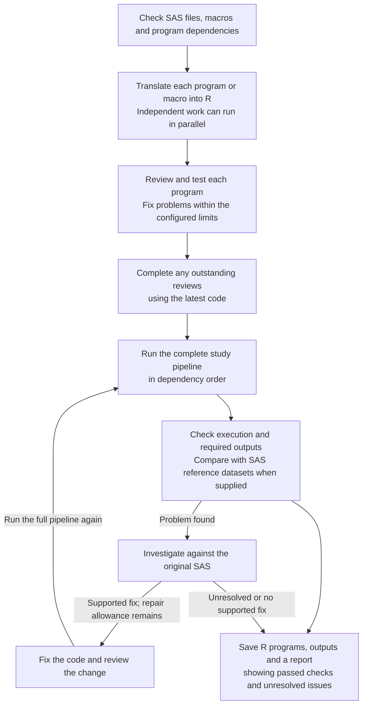

# Running and reviewing a migration

Detailed guidance for setup, saved files, review, repair and troubleshooting.
For the first run, start with the [README quickstart](../README.md#quickstart).

- [Workflow](#workflow-and-review-order)
- [Preflight coverage](#preflight-and-source-coverage)
- [Files and manual reruns](#files-and-manual-reruns)
- [Progress messages](#reading-the-progress-log)
- [Resume and limits](#resume-and-limit-provider-calls)
- [Parallel translation](#parallel-translation-opt-in)
- [Called macros](#called-macros-in-separate-folders)
- [Study-team FAQ](#frequently-asked-questions)


## Workflow and review order

The work has two parts: **translate and check individual programs**, then
**run the complete study pipeline and check its outputs**. Called macros are
translated too, so programs can use their R equivalents.

Three AI roles help with the work:

| Role | What it does |
| --- | --- |
| Translator | Writes R code based on the original SAS, its macros and the programs it depends on. |
| Reviewer | Separately checks the R code against the SAS and reports possible translation errors. |
| Fixer | Corrects identified problems supported by the SAS source. The changed code is reviewed and tested again. |

The package controls the order of work, the number of repair attempts and the
spending limits using fixed rules. This scheduling logic is called the
**coordinator** in the logs; it is not another AI model. AI review helps find
problems but does not replace independent statistical QC.



**Program dependencies determine the order.** For example, a summary program that reads an analysis dataset waits for the
program that creates that dataset. `sas2r` determines the order from the SAS
sources rather than built-in program names.
With [parallel translation](#parallel-translation-opt-in), independent programs
or macros can be translated and reviewed at the same time. A program waits for
the programs it uses to finish their initial translation and checks.

Program execution tests and repairs run one at a time. If a repair changes a
shared R function, programs that use it are checked again. Before running the
full pipeline, the package completes outstanding reviews of the code versions
that will be used. That review step reports findings without changing the code.
The full pipeline also runs one program at a time in dependency order.

**Available source keeps translating when dependencies are missing or uncertain.**
Preflight lists the affected programs and what is needed. New findings discovered
by a worker also remain warnings: downstream drafts carry those findings instead
of treating an upstream draft as verified behavior. A component that cannot
finish keeps its available artifacts while other programs continue.

Execution remains separate. Missing required input data or source dependencies
prevent the affected smoke checks and defer the affected root programs in the
bundle attempt; unaffected programs still execute, the attempt records what it
skipped, and skipped outputs count as not executed rather than missing. Such an
attempt cannot be reported as migration-ready. Deferral does not trigger
repeated attempts to repair code for absent resources. Missing configured SAS
references prevent comparison, but do not by themselves prevent execution.
An intermediate dataset with no producer visible to the scanner, or a possible
statement-order issue, remains a warning and can be tested by execution. This
allows translated macros to create their intermediate datasets at runtime.
`execute = FALSE` explicitly requests code only. Reports show saved code, component
failures and execution activity separately. A partial translation is never marked
validated. The exported R programs and supporting files form the **bundle**.

No readable source, unusable configuration, inconsistent pipeline coverage,
accounting/output-write failures and provider-wide failures still stop the run.
The existing budget and retry limits remain in force. Completed artifacts and
component diagnostics are retained for review and resume.

A repair cannot replace the chosen result if it loses checks that had already
passed. If a new run initially performs worse than a saved result, that earlier
result is retained while the new run uses its remaining repair allowance. If a
later repair makes the chosen result from the current run worse, further repair
stops and that chosen result is kept. The report distinguishes retained results
from the outcome of the current run.

## Preflight and source coverage

Before provider setup, the shared preflight checks that every scanned source file
is accounted for in the pipeline. Inspect `sas_preflight(...)$pipeline$sources`
for each file's components, translation positions and execution roles: main
program, startup, called macro, included by its caller, or an explicit
exclusion when no active source units remain. `$pipeline$execution_order` uses
the same bundle planner as execution. Unexplained omissions, duplicate scheduled
components and conflicting component names stop translation before model calls. For example, a regular `setup.sas` file cannot
share the reserved startup component with `autoexec.sas`; preflight names both
files and asks you to rename the conflicting source and rescan.
Complete coverage is separate from input availability and translation quality;
preflight can still report `needs_attention` for other findings.
The main programs are listed in dependency order; this does not mean they are
independent. A consumer waits for its upstream components during parallel
translation, and the full bundle executes the main programs serially in that order.
Cycles are warnings: drafts use stable source order inside a cycle, while execution
waits for the dependency issue to be resolved. This draft order is not a claim
that the programs can execute in that order.

## Files and manual reruns

Open `migration_output/<run_id>/START_HERE.html` first. It links the selected
scripts, errors, output comparisons, and instructions for running or editing code.
Its top banner summarizes the current run, the reason for any block or failure,
affected components, and whether component fixes, bundle execution and bundle
fixes ran. The same summary is printed to the console and saved in
`<run_id>/diagnostics/logs/run-outcome.log`. An existing bundle or saved partial
code does not mean the current run completed successfully.

```text
<run_id>/
  START_HERE.html
  manifest.json
  bundle/                 # all available selected code, including failed code
    README.md
    run.R
    autoexec.R
    programs/
    macros/
    runtime/
    output/               # manual reruns only; created when needed
  outputs/                # saved automated deliverables
    datasets/<library>/
    tlf/
  report/                 # translation.md, report.json, comparison-details/
  diagnostics/            # attempts, revisions, smoke tests, logs, scratch data
```

A component that produced no code is labelled **not generated**. A completed
execution is separate from reference equivalence; saved outputs can be partial
or unvalidated. Requested WORK datasets are deliverables too. Unrequested scratch
files stay in diagnostics, and previous attempts retain their own evidence.

From `result$bundle_dir`, run `Rscript run.R` or `source("run.R")` in a fresh R
session. The launcher loads the runtime and macros, then runs programs in
order. Manual writes use `.sas2r_output_root` in `autoexec.R`, initially
`bundle/output/`; they do not overwrite saved automated outputs. Change that
root to keep separate manual iterations. Relative report files are written below
`output/tlf/`; review explicit paths or other relative file access in edited code.

`sas_write()` copies this editable bundle and its guide. Saved automated outputs
are exported separately under `saved-outputs/`, and reports under `report/`.
Copy the whole bundle when moving it, install the R packages listed in its guide,
and either copy inputs or configure accessible external data paths. No LLM key or
sas2r installation is needed to run the included runtime. Failed scripts remain
available for human repair; edits and reruns require new QC.

Relative paths inside translated LIBNAME calls resolve against
`.sas2r_execution_root` in `autoexec.R`, initially the source project directory.
Relative paths in the registry itself remain relative to the bundle folder.
Rebinding a known physical library retains its separate write folder, so later
programs can read earlier generated datasets. New library assignments receive
separate output folders; an explicit `write_path` still takes effect. Missing
input errors list the paths searched and execution root.

Input data is not copied: update `.sas2r_execution_root`, the registry in
`autoexec.R`, and any explicit source LIBNAME
paths if those inputs move. A manual rerun does not update the exported report.

## Review and repair details

Shared helper repairs replace only the complete functions the fixer changes.
Omitted functions remain available, including prior accepted helper edits.
Checks, static review, smoke tests and the exported bundle use the same assembled
helper runtime; rejected candidates leave the retained runtime intact.

When a required output is absent and a recorded intermediate is empty, sas2r
investigates the producer and consumer source/code before authorizing a repair
for that issue. Empty data alone does not prove which script is wrong. The
observation stays in local diagnostics; agents receive no rows, row counts or
reference comparison answers. Independent source-grounded defects remain
repairable. Execution blockers take priority within the existing limits.

Dependency context gives SAS and R bodies paired space and marks truncation.
A scheduled follow-up can recover an unavailable review by explicitly reviewing
the full component with extra focus. A clean focused-only review does not replace
a full review; the report shows both outcomes.

Component review checks whether the R preserves the SAS calculations, filters,
merges and side effects. Bundle repair adds an integration focus: how selected
callers and callees exchange values, which inputs are available, execution order,
and required output content. Changed code still receives a full semantic review.
Within the existing context limit, bundle requests include selected downstream
caller/consumer source and R code as well as upstream dependencies.
The reviewer remains static and read-only; runtime diagnostics come from the
executor. Completed reviews are reused only for the same source, code, helpers,
dependencies, policy, model settings, scope and supplied diagnostic context.
Changed installed-dependency facts can refresh that review without regenerating
the saved translation; changing only budgets or connection timeouts does not.

Harmless representation differences, such as unobserved trailing padding or
figure spacing, need not be reproduced. Source-visible truncation, special
missing-value behavior, statistics, meaningful labels and report sections still
matter. File existence alone does not prove a complete report. Simple, uniquely
bound source `KEEP`/`DROP` declarations can explain excluded columns; ambiguous
syntax remains unknown. These facts cannot authorize invented values or changed
source rules, and reference comparison settings stay outside authoring context.

The starting page, manifest and translation report distinguish all recorded
bundle attempts from execution of the current revision and selection. A prior
attempt is credited to the current code only when its recorded source, code,
helper and preceding-component context match. Older records lacking that
information remain visible without certifying the current scripts.

Bundle repair defaults to **two fixer calls per component**, in addition to the
immediate program-repair allowance. `max_bundle_repair_rounds = NULL` lets that
bounded allowance scale with the number of components; supply a number to cap
total bundle fixer calls, or `0` to disable them. `usage_limits` still bounds the
whole run. Failed and ineffective repair calls consume their component allowance.

The authoritative bundle run stops at the first execution error. sas2r then
checks unvisited independent branches in fresh smoke environments, queues known
mechanical and output failures by component, and repairs independent causes
before rerunning the full bundle. Downstream failures caused by an upstream
blocker wait for fresh evidence. An identical patch or failed fixer is deferred;
other independent components can continue. A shared-helper patch requires a
fresh run before further repairs. Diagnostic outputs never replace the complete
bundle acceptance check, and lost execution or output coverage rejects a repair.
Repair counts, deferred components, and diagnostic records appear in the report.

## Agent tool limits

Each translator, reviewer, or fixer invocation has a **30-tool-call shared
allowance** by default. Individual tools inherit that allowance, so several
useful rule or macro lookups do not exhaust a separate small quota. A project
can adjust a role in `.sas2r/agents/translator.yml` (likewise `reviewer.yml` and
`fixer.yml`):

<!-- sas2r-example: agent translator -->
```yaml
tool_call_limit: 45
tools:
  search_skills: { max_calls: 6 } # optional narrower quota for this tool
```

The shared ceiling and any explicit tool quotas remain enforced; they reset on
the next agent invocation. The run-wide `usage_limits$max_tool_calls` is separate.
The model sees its remaining allowance. At exhaustion, native ellmer gathering
stops and the runner requests a final answer with tools closed and the evidence
already collected. Final-answer retries remain bounded; an incomplete answer
still cannot pass validation. Expected tool refusals and invalid arguments return
feedback, while unexpected tool errors remain visible. Completing an agent
request does not mean that every requested lookup succeeded.

Before generation, the console shows loaded R, sas2r and ellmer versions and the
effective agent and repair limits. The same information is saved in the run report
and usage ledger. Tool records include component, revision, request and invocation
identifiers; completion messages identify denied or failed lookups.

## The four statuses

Every run ends in exactly one status. It is decided from what actually executed and what the output checks found — never from what an AI model claims:

- **`blocked`** — something required went wrong: a program failed to run, or a required output is missing or doesn't match. The report names the program and shows the evidence.
- **`needs_review`** — execution was deferred, or required review/lineage evidence remains incomplete or blocked. Programs may still have run successfully; read the reported reason.
- **`migration_ready`** — bundle execution, required output checks, and lineage requirements passed, without passing reference evidence for a required target. This can mean only existence/readability checks were available.
- **`validated`** — those requirements passed and at least one required target supplied a passing reference comparison. Other outputs can remain unreferenced.

Check coverage alongside the status: `print(result)` and the reports distinguish
outputs produced, reference-compared, passed, and reference-passed. The JSON
report lists `validated_targets` and `unreferenced_targets` under `coverage`.
For example, one passing referenced output and two unreferenced outputs can
produce `validated`; it does not mean all three were compared.

**THIS IS NOT PARITY.** `validated` means your configured reference comparisons passed under the tolerances you declared. It is not proof of SAS equivalence, and it does not replace double programming or independent statistical QC.

## Reading the progress log

Live console updates are enabled by default in interactive R and `Rscript`.
Set `options(sas2r.progress = FALSE)` before a run to hide routine progress,
including the initial preflight summary; use `options(sas2r.progress = TRUE)`
to show it again. This is an R session option, not an `_sas2r.yml` setting.
It controls console output only: translation, parallelism and quality checks
run the same way. The final outcome and report locations remain visible, and
saved diagnostics and HTML reports are still written. The final outcome also
includes the pipeline summary. Tests disable routine progress by default.
With progress disabled, wrap `sas_translate()` in `suppressMessages()` to hide
the final summary and report locations too. This does not suppress errors or
change returned results or saved reports.

Source parsing and macro-index caches live in the R session's temporary
directory. They do not write into the input project and disappear when the
session ends. Resume checkpoints and reports remain in the selected output
directory and are separate from these disposable parsing caches.

| Log message | What it establishes |
| --- | --- |
| `reviewer ...: review completed: repair_required, 3 tool calls` | The request completed and the review found a material issue. The tool count describes tool use, not findings. Older logs use `ok` for request completion alone. |
| `coordinator ...: mechanical checks passed` | Generated code passed syntax and mechanical contract checks. |
| `coordinator ...: review completed -- reviewed_no_material_finding` | The review found no material issue. Execution and reference comparison remain separate checks. |
| `coordinator ...: review unavailable` | No usable review was obtained. The reason is recorded, and smoke execution may continue. |
| `smoke ...: passed` | The program executed and any applicable source population checks passed. Inspect unverified checks separately; this does not establish agreement with SAS reference data. |
| `smoke ...: failed -- blocked by upstream: ...` | Execution failed in the named dependency. The consumer is recorded as blocked and is not sent to the fixer for that upstream crash. |
| `bundle ... assessed -- migration_ready` | The selected bundle met the requirements described above. Read reference coverage separately. |
| `ERROR: coordinator ...: Dependency findings require source reconciliation: ...` | The named component and its consumers are deferred from execution. Unaffected work continues, and the bundle attempt executes the other root programs while recording the skipped ones. |
| `ERROR: Run incomplete - blocked` | A required part of the migration could not complete or pass. The summary names the reason, recorded activity and next action. |
| `ERROR: Run incomplete - failed` | An exception terminated the run. Available diagnostics are saved and the original exception is raised. |
| `WARNING: Run requires review` | The run returned `needs_review`; inspect the outstanding review or execution evidence before use. |

A controlled block still returns the `sas2r_translation` result and preserves
available work. The error severity makes the incomplete outcome visible without
aborting independent work immediately. The HTML uses a red banner for a blocked
or failed run and an amber banner when review is required. Attempted execution,
fixer invocation and passing validation are reported separately; invoking a fixer
does not mean its patch was accepted or its findings resolved.

Review findings can trigger a fixer even after mechanical checks and smoke tests
pass. A repaired revision is checked, reviewed, and executed before selection.
A repair that loses passing mechanical, execution, review, or source population
evidence is rejected; the previous revision and its unresolved findings remain.
Errors include the underlying R condition and saved execution logs. If a current
run is blocked while an older selected bundle remains on disk, the progress log
identifies that older selection explicitly.

`max_program_repair_rounds` is the total immediate-repair allowance per
component for the run, including revisits. A deferred component is retried when
its relevant dependencies change or a specifically awaited caller becomes
available. Completed reviews are reused within a run when the code, dependency
code, helper runtime and review configuration are unchanged.

Each fixer invocation can make one additional, budgeted request to correct a
parse or lint error in its proposed code. Persistent mechanical failures keep
the previous selected revision and save the rejected candidate's diagnostics.
An identical patch means no change was proposed; it does not clear the failure.
Bundle repair can still address a separately documented downstream code defect
after an upstream no-op. Downstream mismatches inherited from unresolved inputs
wait for those inputs to be resolved.

Unexpanded output expressions, such as `figure-&group..pdf`, appear separately
from concrete output targets in the report and starting page. Finding matching
files does not establish that the entire expected family was produced. An
unresolved required expression prevents readiness; its filenames and coverage
need source-grounded review.

For debugging a failed bundle, use `sas_translate(..., keep_raw_attempts = TRUE)`
to retain each component smoke execution's separate library folders and `run.R`
replay script. The component's `smoke_execution` in `report.json` lists the
output paths, hashes, configured-input hashes from run startup and replay path. These are partial
execution artifacts, not reference-validated final datasets. By default, raw
unselected outputs are pruned; smoke records and logs remain available under
`smoke_attempt_001/logs/` in the run folder.

Translator, reviewer, and fixer receive runtime signatures, argument rules,
return values, limitations, and examples directly from the package's helper
reference. Mechanical checks reject invented helper arguments before execution.
For equality, use `chr_cmp(a, b, op = "==")`; `op = "="` raises an error.
Omitting `op` returns an ordering result (`-1`, `0`, `1`), so an explicit operator
is required when using the result as a Boolean condition.

Source population checks use parsed SAS and local inputs, independently of the
agent's declared contract. Supported checks cover row counts for single-input
SET steps without row filters and BY-group counts for two-input MERGE steps with
simple IN filters. For example, a matched subject with three events must retain
three records. Filters, unsupported step bodies, repeated member writes, source library
assignments within a program, and unavailable intermediates remain `unverified`; see `source_population` in the
Markdown report and `source_population_checks` in component JSON evidence.
Incompatible BY types between source inputs leave the population check
`unverified` with a diagnostic. When the source keys are compatible but the
translation changes the output to an incompatible type, the check fails.
These checks cover population behavior, not all derived values or SAS parity.

The elapsed-time and
usage summary distinguishes known spend from unknown-cost calls: `$0.0000`
known spend with unknown-cost calls does not mean the run was free.

## Reference differences: translation error or different specification?

Use references generated by the same SAS programs, input snapshot, formats,
macros, and parameters. A similarly named ADaM dataset is not sufficient: a
reference may exclude subjects the source retains, derive additional variables,
or use a different analysis visit definition.

When a comparison fails, inspect schema differences and unmatched rows before
cell examples, then trace the affected derivations back to SAS and the inputs.
Verify that row keys have the same meaning on both sides. An independent R
reconstruction can help diagnose a discrepancy, but it is not a SAS execution.
Resolve source/reference mismatches before using them to drive translation
repairs. See the [comparison guide](output-evidence.md) for saved-output
checks and ambiguous alignment.

## When scripts are reviewed

Each new script is reviewed against the SAS source, and each actual repair
receives another review. If an upstream program or shared R function changes
later, the package checks the earlier scripts that may be affected and performs
applicable execution tests. These are called **smoke tests** in the logs.
They show whether the tested code runs and passes the checks applied to it;
they do not establish that every calculation matches SAS.

Before the full pipeline runs, the package completes outstanding AI reviews.
A completed review is reused only when its code and supporting information
still match. This avoids repeating an AI review after every shared-code change.
The final review step collects findings without making repairs itself; findings
supported by the SAS source can be addressed in the full-pipeline repair stage.

A script is still awaiting acceptance if its review is missing, out of date or
has unresolved findings, even when execution succeeds and no reference datasets
are configured. Repairs during the full-pipeline stage also require review and
a fresh run, within the same configured repair limits.

## Resume and limit provider calls

Repeat the same `sas_translate()` call with `resume = TRUE` to reuse saved
translation revisions and completed reviews when sources, inputs, QC requirements,
model settings, runtime, and role prompts still match. Transport timeouts, retry
limits, run budgets, and `max_parallel_translations` changes alone do not invalidate
completed revisions. In parallel mode, saved progress distinguishes a draft from
a component that has completed immediate checks and repair. Progress is also
saved after each final-checkpoint review.
Interrupted final reviews resume using the saved review history. Component and
bundle fixer-call counts are retained, including an invocation interrupted before
its answer was saved; resume does not reset those repair allowances or recorded
component revisit counts. Changed or
missing artifacts regenerate. Within an unchanged smoke context, passing or
deferred results can be reused; changed code, helpers, input identity or callable
paths require new checks. Full bundle output checks use fresh attempts. An
unavailable review is retried within the usage budget.

Upgrades can cause new provider calls. When a checkpoint remains compatible,
changed reviewer facts (such as helper documentation, rulebook content or
installed dependency versions) refresh reviews while retaining translations.
Saved reviews from before request identities were recorded also receive a fresh
review; progress explains this with `saved review predates request identity;
refreshing`. Changes to shared worker prompts, skills, policy or runtime helpers
can invalidate the checkpoint itself and regenerate translations as well. A
version-number change alone does not require regeneration.
Version 0.4.5 changes the shared agent policy, so checkpoints created with an
earlier policy regenerate translations under the current resume rules.
The parallel checkpoint format can import compatible version-8 checkpoints while
preserving repair counts. Unrecorded historical revisit counts remain unknown;
resume does not grant a new automatic revisit allowance. Other incompatible
checkpoints regenerate. Progress reports the reason when a checkpoint cannot be reused.

Every limit is commented out in the examples by default, so a run records usage
in observe mode and finishes without interruption. Uncomment `budget_usd` or a
`usage_limits` ceiling only if you want the run to stop when it is reached. If
you do, size it from the usage summary of a completed run: requests and tool
executions per program or macro vary by model, reasoning setting and study.
`usage_limits = list(max_calls = 0)` prevents provider requests entirely. Limits and usage are
reported explicitly; the usage ledger is cumulative across resumed runs.
See `?sas_translate` and the [migration evidence guide](migration-evidence.md)
for the complete limits and reuse contract.

## Parallel translation (opt-in)

Set how many SAS programs or called macros can be processed at the same time
with the `sas_translate()` argument, for example
`sas_translate("study", max_parallel_translations = 2)`.
The default is **1**. A value of **2** allows up to two program-or-macro
translation workflows at once, including their review and repair steps. It does
not start two translators, two reviewers and two fixers all at once. A **worker**
is a separate R process handling an assigned translation or review task. The
coordinator assigns the work and records its results.

Each task uses the same source information, tools, configured model settings and
quality checks as the one-at-a-time workflow. It starts with a recorded version
of the upstream code it needs; workers do not share one ongoing AI conversation.
Independent programs can translate and review together. A program that uses
another program's output waits for that upstream program's initial work to finish.
Execution tests, repairs and the full study run still happen one at a time.
The whole run shares the configured AI-call, tool-use and spending limits;
allowing more parallel work does not increase those limits or repair allowances.

This number is not a CPU count. Much of translation time can be spent waiting
for the AI provider, so more than one task can make progress on the same CPU.
Start with one, then compare two on your study. Check elapsed time, memory use
and provider limits before increasing it further. Custom AI connections that
cannot run in a separate R process use one worker and report the reason.

If you supply your own `sas2r_llm` adapter, set `attr(llm, "parallel_factory")`
to a function that takes no arguments and returns a fresh adapter. Each worker
calls it in a new R process. The factory must be self-contained: objects that
exist only in the calling session's global environment are not transported.
Capture the small settings it needs in its own closure, and access package
functions through their installed namespaces. Keep captured state small. The
combined encoded startup data (adapter factories, provider configuration and
capability settings) has a conservative limit of **100,000 bytes per worker**.
Exceeding it stops that worker's launch with a configuration error showing the
size and the remedy: reduce captured settings or use `max_parallel_translations = 1`.
This limit is on adapter startup data, not the SAS programs or study datasets.
Without a reconstruction factory, the custom adapter uses one workflow and
reports the reason.

For the supplied ellmer connections, parallel mode requires **ellmer 0.5.0 or
newer** and `llm.max_tries: 1` (the
default); older ellmer installations visibly use one workflow. If both
`max_parallel_translations` and `llm.max_tries` exceed 1, preflight and translation
stop before provider calls and explain which setting to change. Set `llm.max_tries`
to 1 for parallel translation, or `max_parallel_translations` to 1 for provider-level
retries. Function argument overrides are applied before this check. The existing
bounded agent retry policy still applies. With ellmer 0.5.0+, `max_calls` counts each request
within a tool conversation, plus finalization, in both modes. See the
[usage-counting details](migration-evidence.md#coverage-limits-and-reuse)
before reusing a limit tuned to older ellmer.

Missing resources and uncertain dependencies are reported while available source
continues translating in both execution modes. Known upstream order is preserved;
cycle members receive provisional drafts. Actual component failures do not cancel
independent work. Bundle execution skips the programs affected by unavailable
dependencies and records them as not executed.
Worker findings use the scanner's recognized SAS macro list, so supplied macro
names such as `qleft` and `qtrim` do not create false missing dependencies.
Macro variables assigned anywhere in the scanned source, supplied project macros
and scheduled components are recognized the same way. A reported name the
scanner cannot classify is recorded as an observation for agents and the report;
it does not by itself defer execution. Only a macro or dataset the project
cannot supply still does.
[SAS session metadata views](https://support.sas.com/documentation/cdl/en/sqlproc/63043/HTML/default/n02s19q65mw08gn140bwfdh7spx7.htm), such as `SASHELP.VEXTFL` and
`DICTIONARY.EXTFILES`, are environment queries rather than missing study-data
producers. Likewise, a macro variable used only in a LIBNAME path does not need
another program when the library resolver has already selected its configured
path. This uses the actual source and library binding, regardless of the
variable's name. Variables needed elsewhere, unknown datasets and missing
programs/macros still require reconciliation. These classifications preserve
the reported observations and do not waive review, execution or output checks;
unsupported environment-query behavior can still prevent a successful run.
Preflight uses the same metadata classification (`inputs$status = "environment"`).
Documented automatic variables used by the source, such as `&SYSDATE9`, `&SYSVER`
and `&SYSLAST`, and search options `SASAUTOS`/`FMTSEARCH` are recognized as SAS
facilities. Recognition does not implement them: session date/time must stay fixed
at run start; R's version is not SAS's version; status variables and the last
dataset still depend on earlier operations. Search options do not supply missing
macros or custom formats. Agents receive this guidance and must report unsupported
behavior. See the [SAS automatic-variable reference](https://support.sas.com/documentation/cdl/en/mcrolref/62978/HTML/default/p14ym6slnzfstzn1t9yp5v31ijis.htm)
and [system-option reference](https://support.sas.com/documentation/cdl/en/lesysoptsref/64892/HTML/default/n1ag2fud7ue3aln1xiqqtev7ergg.htm).
Ordinary data such as `SASHELP.CLASS`, `SASUSER.*` and `WORK.*` retain their real
input/producer requirements. No whole library or SYS prefix is exempted.
Resuming reassesses saved dependency observations; old blockers are not simply
carried into the new run.
Automatic graph correction/reassignment is a separate planned change. Offline
parity checks do not establish unchanged live-model quality or a particular speedup;
parallel execution remains opt-in until the paired live comparison is completed.
See the [migration evidence guide](migration-evidence.md#parallel-coordination-and-evidence)
for requested/effective concurrency, process logs and interrupted-work accounting.

## Code style and packages

Translated code is written for maintenance as well as fidelity. Two
configuration keys control the style:

```yaml
dialect: tidyverse
allowlist: [base, dplyr, tidyr, ggplot2, stringr, forcats, purrr, lubridate, tibble, haven, stats, utils, graphics, grDevices, grid]
```

`dialect: tidyverse` is the default. The translator, macro translator and fixer
receive a style block naming the allowlisted, installed tidyverse packages to
prefer and what each is for: dplyr for DATA step logic and PROC SQL, tidyr for
PROC TRANSPOSE, ggplot2 for figures, stringr for character functions, forcats
for format-driven levels, lubridate for dates. When no preferred package
expresses the SAS behavior faithfully, base R or a bundle helper is the correct
choice and is not a finding. The helpers that carry SAS semantics stay
mandatory in every style: `lib_read` and `lib_write`, `sas_sort` (missing
sorts first), `sas_merge`, `chr_cmp` and `%notin%`, `sas_round` and the format
helpers. `dialect: base` reverses the preference; any other text is passed to
the prompts as written.

`allowlist` replaces the default package list shown above. Only packages that
are both allowlisted and installed are recommended; a package that is
allowlisted but not installed is named as unusable. The reviewer never grades
style; it judges SAS fidelity only. The bundle README lists the packages the
generated code references. Changing either key invalidates resume checkpoints.
The translation report carries an advisory style observation, counting
tidyverse package calls against base data-frame operations, so live runs can
be compared before and after a style change.

## Called macros in separate folders

Configure macro directories in `_sas2r.yml`; relative paths are resolved from
that configuration file:

```yaml
macros:
  search_path:
    - macros
    - shared/macros
```

When a program calls `%my_macro(...)`, sas2r finds its definition in those
folders and translates it into `bundle/macros/my_macro.R`. It also follows calls
from that macro to other macros. Each called definition has one reusable R
function, even when several programs use it or several definitions share a SAS
file. Uncalled library macros are not sent for translation.

Macros are translated before their callers. Agents receive upstream function
contracts, and the bundle's `autoexec.R` loads the standalone functions before
programs run. `sas_write()` exports the macro scripts and generated
`tests_macros/test-<name>.R` interface tests. Those tests check the function name,
parameters and known defaults; execution and SAS-reference comparison provide
separate evidence about behavior.

Resolved project macro calls are tracked separately from runtime helpers.
Repairs refresh helper-use metadata without treating project functions as
unknown runtime helpers. Standalone smoke tests use an available caller's first
top-level call with literal arguments, preserving multiline calls. A caller
that has not been generated reports `caller_not_generated`; calls requiring
prior setup, variables, loops or other enclosing context report
`caller_context_required` and run as part of their containing program. A smoke
pass for that program does not establish that every conditional macro ran.

Programs that define and invoke internal macros must retain that invocation.
A mechanical check catches definitions-only R when the source invokes a macro
outside its definitions. Shared guidance also covers returned values, nested
macro scopes and repeated calls, including intentional clearing or retention of
state. Graphics guidance preserves source statistical definitions through the
renderer, requested summary content, axis behavior and pagination settings;
visual polish remains a human task.

For explicit dataset cleanup, generated functions can use
`lib_delete("work", c("scratch_a", "scratch_b"))`. This removes stored datasets;
garbage collection is not a substitute. `lib_members("work")` lists ordinary
supported dataset names without reading rows, using the same lookup as
`lib_exists()` and `lib_read()`. It can expand source-requested ordinary member
lists, including `_ALL_` when the listing and deletion contracts cover that
library. Deleting a member backed by a separate input directory remains
unsupported, with input files preserved. Ranges, prefix lists, views and name
literals still require supported source-specific handling. Member listing is a
runtime helper, not an additional agent tool.
Unresolved dynamic expressions remain explicit limitations; agents must not
bypass them with `eval()`/`parse()` or silently drop meaningful operations.

Inspect `sas_preflight(...)$called_macros` for the discovered definitions and
planned file paths. Macro translation requires an AI provider. Dynamic macro
names, nested macro definitions, `%INCLUDE` inside an autocall macro, and library
files with executable initialization outside their macro definitions remain
unresolved. Translation attempts the available source and reports missing logic;
execution remains unavailable for affected components. If a definition is missing,
configure `macros.search_path` or supply the definition
in the scanned sources, then run preflight again. Preflight returns dependency
findings for inspection; malformed source such as an unterminated macro comment
raises a parse error with its location. sas2r does not expand arbitrary SAS macro
code. Top-level `%LET`, `OPTIONS`, and other initialization in an autocall file
are not silently discarded: they can change macro values, execution, or output.

Dependency detection classifies percent-prefixed syntax before looking up user
macros. Definitions, control statements, built-in functions (including documented
NLS macro functions and SAS-supplied NLS autocall macros), `%INCLUDE`, `%LIST`,
`%RUN`, and `%label:` declarations are not user calls. Macro/block comments and
single-quoted literals do not introduce calls; double-quoted text can. Simple
`%NRSTR(...)` text is treated as literal. Computed names and quoting that requires
expansion (such as `%UNQUOTE(%NRSTR(%generated_call()))`) produce an explicit analysis
warning, rather than a missing-macro-file diagnosis. Macro text inside ordinary
SAS `* comment;` statements also requires expansion and is reported separately.
Unquoting a variable alone, such as `%UNQUOTE(&condition)` in a WHERE expression,
is advisory: it does not prove that a user macro is called. Such generated text
remains unverified; offline mapping does not fully execute the macro language.

For literal SQL patterns, use single quotes, for example `like '%Total%'`.
In `like "%Total%"`, SAS attempts to invoke `%Total`, even without parentheses.
sas2r reports the unresolved name and marks the draft incomplete: assuming literal text would hide
a genuine call whose macro folder was not configured. Use SAS macro quoting
when literal percent text must coexist with macro expansion.

SAS requires matching quotation marks within `%* ...;` comments; a semicolon
inside matched quotes does not end the comment. Use `/* Don't run this step */`
for prose with an unmatched apostrophe. `%STR` and `%NRSTR` require a preceding
percent sign for unmatched quotes or parentheses, for example
`%nrstr(Don%'t modify this table)`. Ordinary `* ...;` comments can still execute
macro statements; use block comments for inactive macro text.
See SAS's [macro comment rules](https://support.sas.com/documentation/cdl/en/mcrolref/61885/HTML/default/a000543665.htm)
and [macro quoting rules](https://support.sas.com/documentation/cdl/en/mcrolref/61885/HTML/default/a001061290.htm).

Statement splitting does not fully support macro-quoted semicolons, such as
`%exec_sql(query=%str(select a; select b;))`. Simplify these forms or supply
expanded source before translation; a discovered macro name does not prove
that its argument or statement boundaries were parsed correctly. Similarly,
`call execute('%my_macro(' || id || ')')` constructs code at runtime, so its
single-quoted text is not mapped as a static call. Provide expanded source and
the required macro definitions for such programs.

## Handy checks before a long run

<!-- sas2r-example: network connectivity -->
```r
library(sas2r)

# Is my _sas2r.yml valid? (paths, provider names, settings)
sas_config("_sas2r.yml")

# Which models can my account use? (name any model to identify yourself;
# the answer lists everything your account serves)
sas_llm_models(list(provider = "anthropic", model = "claude-sonnet-5"))

# Does my sign-in actually work?
sas_llm_probe(list(provider = "anthropic", model = "claude-sonnet-5"))

```

<!-- sas2r-example: offline readme-comparison -->
```r
# Compare saved outputs with known unique subject keys. This makes no AI calls.
# result$outputs_dir is the selected output snapshot for this run;
# named-library datasets retain their library subdirectory.
comparison <- compare_datasets(
  base = haven::read_xpt("data/reference/adsl.xpt"),
  comp = readRDS(file.path(result$outputs_dir, "datasets", "adam", "adsl.rds")),
  keys = c("STUDYID", "USUBJID"),
  profile = compare_profile(abs = 1e-8, rel = 0)
)
passed(comparison)
write_comparison_report(comparison, file = "adsl-comparison.md")
stopifnot(passed(comparison))
```

`compare_datasets()` uses row order when keys are omitted and pairs duplicate
keys by occurrence. For repeated records or inferred keys, use
`compare_aligned_outputs()` as shown in the [comparison guide](output-evidence.md).
These standalone checks produce comparison evidence without changing the saved
migration status or rerunning the bundle.

## Frequently asked questions

See the [study-team FAQ](../README.md#frequently-asked-questions)
for preparation, reference outputs, independent QC, dependencies, parallel
timing, interrupted runs, privacy and working with the exported R code.

## Execution timeouts and outputs needing manual review

The output directory may be nested below an input library. Keep input libraries
outside the generated output tree itself; an output root that contains an entire
input library is refused because excluding generated files would hide that data.

Configure execution limits in `_sas2r.yml` (seconds):

```yaml
migration:
  smoke_timeout: 60
  bundle_timeout: 120
```

The smoke limit covers a component and its dependency prefix. The bundle limit
covers the entire study in one process. Increase `bundle_timeout` for a larger
study; a timeout alone does not prove a translation error. The failure reason
and START_HERE report name the setting and the actual limit used.

Flat-file outputs from PROC EXPORT or FILE are checked for existence only.
An existing required file keeps the run at `needs_review`; a missing required
file blocks it. Review contents against the source and reference independently.
The automated fixer does not repair an existing file merely because its content
has no automated assessment. For deliberately optional artifacts, list their
inferred target names under `outputs.optional`:

```yaml
outputs:
  optional: [outputs/debug.txt]
```

Optional targets remain visible in the report but do not gate readiness or
trigger output repairs. Do not mark required study deliverables optional.
If every target is optional, the run remains `needs_review`: no required output
contract was assessed.

A `budget_usd` cap using catalog estimates must explicitly select
`budget_mode = "soft"` (YAML `budget.mode: soft`). It stops new requests once
recorded spend reaches the threshold; an in-flight request can overshoot it.
Strict dollar enforcement instead needs organization pricing and rates.

Each root program starts with the configured library bindings. Explicit LIBNAME
changes and CLEAR take effect within that program; later programs start with the
configured bindings again. Written intermediate datasets remain on disk.

Re-exporting with `sas_write(..., overwrite = TRUE)` replaces files listed in
its export inventory and preserves unrelated files such as NOTES.md and `.git`.
This includes replacing your edits to previously exported scripts or configuration.
Use a new destination to preserve an edited bundle; re-export does not merge edits
or create backups.
A new export path conflicting with an unrelated file is refused. Older exports
without an inventory must be exported to a new empty directory.
